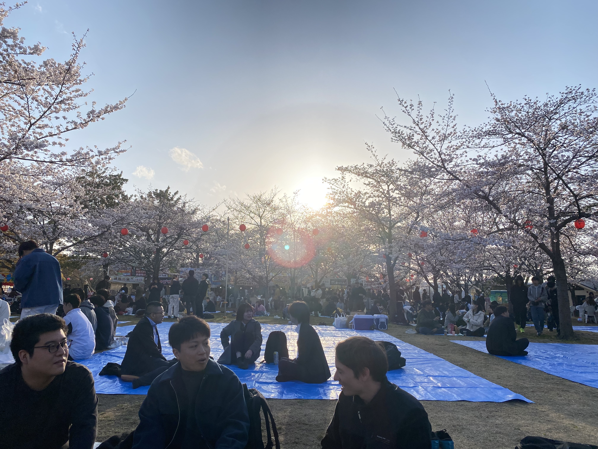

先月もブログ書きました．僭越ながら今月も書かせていただきます，ついにM2になってしまいました中島です．心機一転頑張りましょう！

今回はピカピカの？(修士)1年生に大学院での抱負を聞いてきました！！

# 新M1の抱負
## 竹内柚月
狩川先生の仕事を増やさない。睡眠時間は７時間半。有意義な毎日を送る。
## 日下由希
人に優しいインタフェースに興味があり、こちらの研究室に来ました。今年の目標は健康的な生活を送ることです。
## 谷内玲
人間（社会）に関わる研究を工学的な目線でできるため、本研究室を選択しました。人間的に成長して、楽しい生活ができるよう頑張ります！
## 笠松志佑
学部の時と専門が違うのでまずは知識をつけて早く馴染めるように頑張ります！
今年の目標は八木山の坂に負けずに自転車通学をやり切ることです。
## 國政和真
AIの社会受容に興味があり進学しました。メリハリをつけて国際学会に出られるように頑張ります！よろしくお願いします
## 矢田峻己
なんとなく流れで大学院生になりました。
気が向いたら未解決問題の一つでも解こうと思います。
## 寺端洸貴
(コメントなし)

> [!CUSTOM] pink checklist 筆者より
> 個性溢れる抱負を述べてくれました．みんな仲良く！

# 楽しかったお花見
先日，毎年恒例花見企画を盛大に開催しました．
教授陣も参加し，お酒を飲みながら親睦を深めました．

桜も非常にきれいで，日本に生まれてよかったと思いました．

## おでんくんをおいしくいただきました

## 後光が差している！

# 迫り来る中間発表
技術社会システム専攻では，修士2年の5月（と修士1年の12月）に中間発表が実施されます．M2のみんなは，何か結果を出さなければと躍起になっている状況ではありますが，こういうときこそ同期と協力して，共に乗り越えていくのだと思います．いい発表ができるよう頑張ります！