自然と仲間と過ごす、最高の『夏の学校』
私たちの研究室では毎年B4が企画・プレゼンを行い、3日間の『夏の学校』を実施しています。
岩手での3日間は、天候にも負けず、全員が心を一つにして楽しみ尽くしました！チームの挑戦精神と笑顔が溢れるこの旅の様子をお届けします。

# 1日目：仙台から平庭高原へ

## 平庭ワイナリー

初日は岩手へ。宿の近くにあるワイナリーがお目当ての様子。周辺でとれる山葡萄を生かしたワイン&ぶどうジュースのあまりのおいしさに一同驚嘆。大量に購入し、自分の家に発送する人も。

### 試飲するみんな

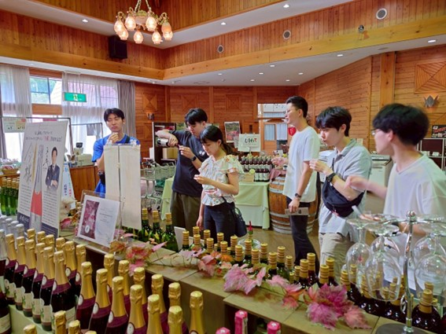

### プロの眼差しでワインを見つめる研究室随一のワイン好き

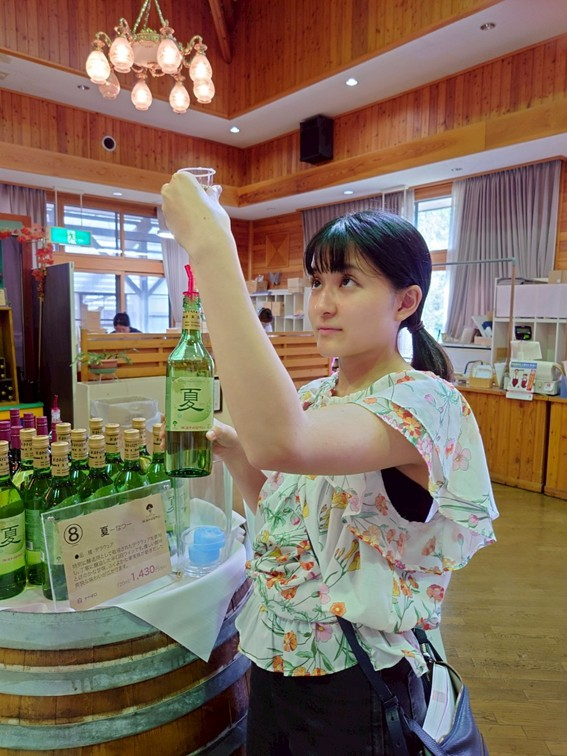

## 夜は花火にバーベキュー

夜には美味しいバーベキューと冷たいビールで大盛り上がり。遅れて参加した先輩方が買ってきてくれた干物が最高に美味しかった。火が落ちてきてからは夏の風物詩「花火」。その後も深夜まで大盛り上がり！ 研究室に入ったばかりの後輩たちとも仲を深め合ったのでした。

### BBQの様子

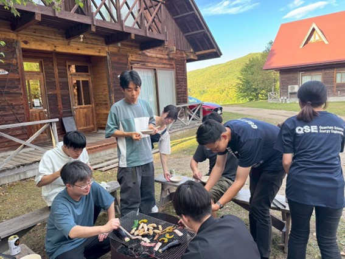

### 花火

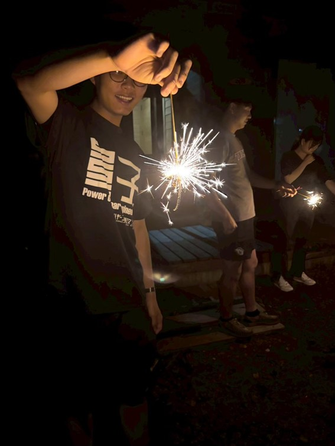

### 雑談タイム

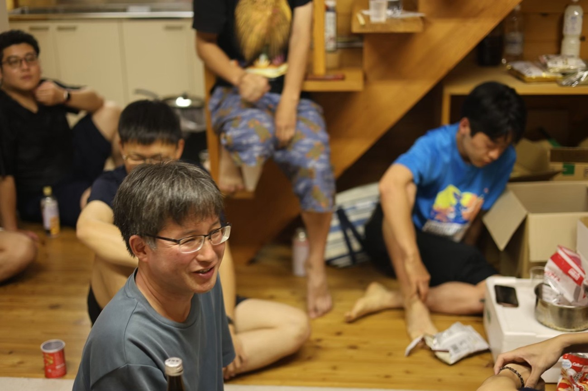

# 2日目：自由行動！龍泉洞へ！

2日目は自由行動！海女体験や登山などグループに分かれて岩手を満喫！我々は龍泉洞へ！

## 料理作りに奮闘する先輩たち

2日目は先輩たちが率先して料理してくれました！ある先輩は、朝早起きして納豆を混ぜてくれました。ある先輩は魚を捌いてくれました。

### 納豆を混ぜてくれる先輩

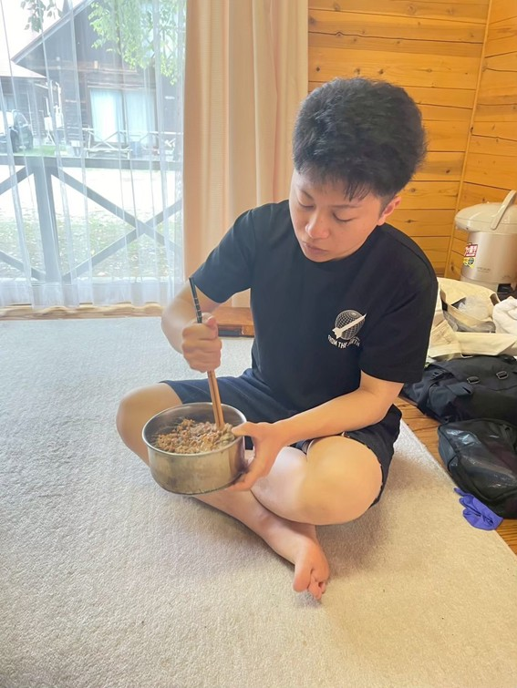

### 納豆を混ぜてくれる教授

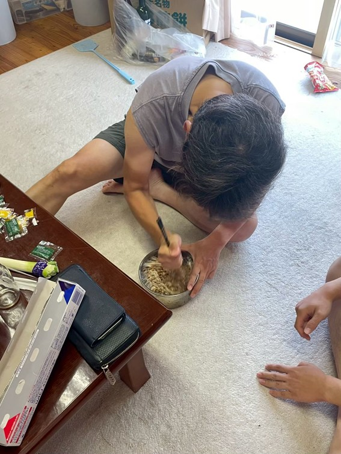

### 魚をさばいてくれる先輩

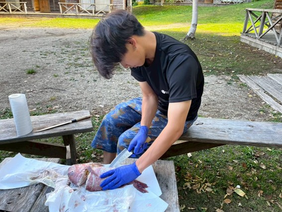

## 龍泉洞組

我々は龍泉洞へ。夏の猛暑の中、ヒヤリと涼しい鍾乳洞へ。狭い入り口を潜ると澄んだ水が眼前に！

### 龍泉洞

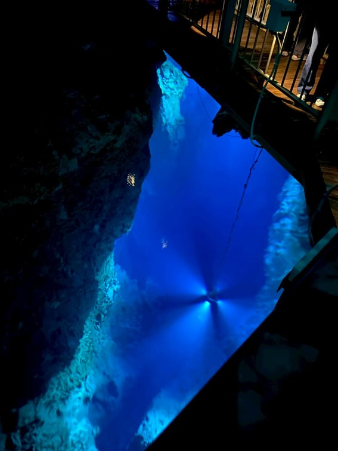

### 渓流釣り

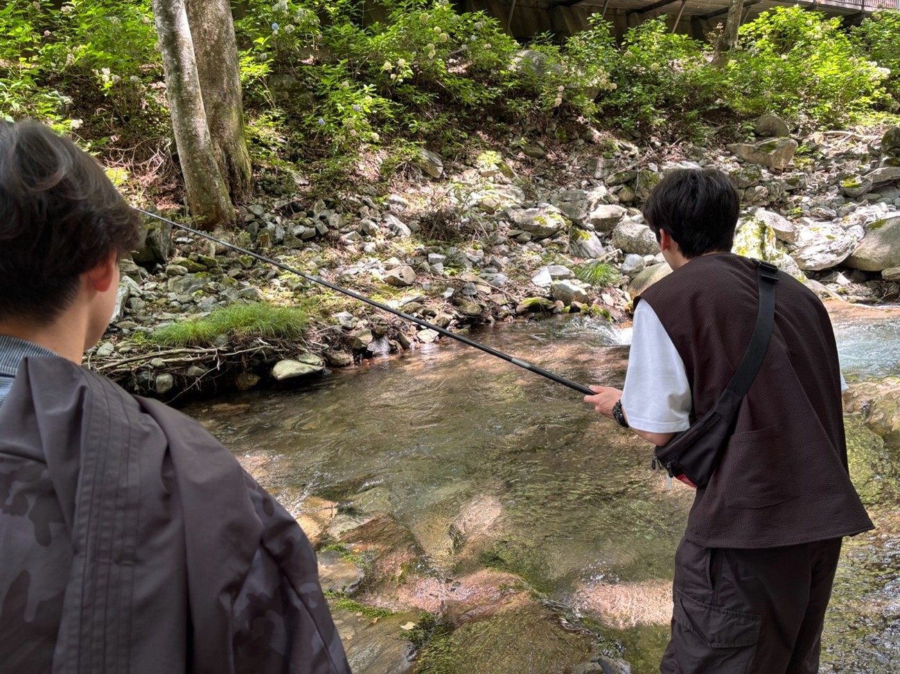

# 3日目：岩手から仙台へ、それぞれの帰路

最終日、皆はそれぞれ異なるルートで仙台へと戻りました。途中、各自が見つけた素晴らしい景色やお土産話を持ち帰り、それぞれの思い出が心に刻まれたことでしょう。

### 日本一のハンバーガー屋へ

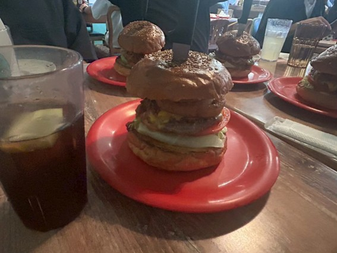

### 中尊寺の胡麻ソフト

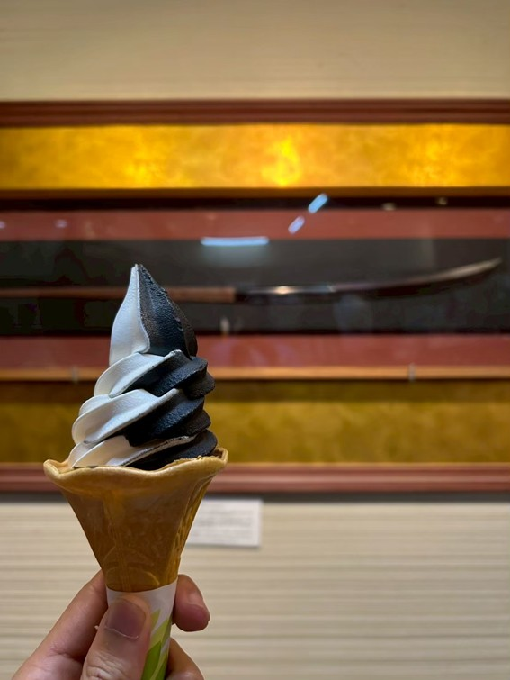

この合宿を通して、私たちは岩手の自然の美しさを堪能し、ラボの仲間との絆をさらに深めることができました。全員がそれぞれの挑戦を楽しみ、学び、そして成長した素晴らしい3日間でした。また次回の冒険が楽しみですね！皆さん、本当にお疲れ様でした！
