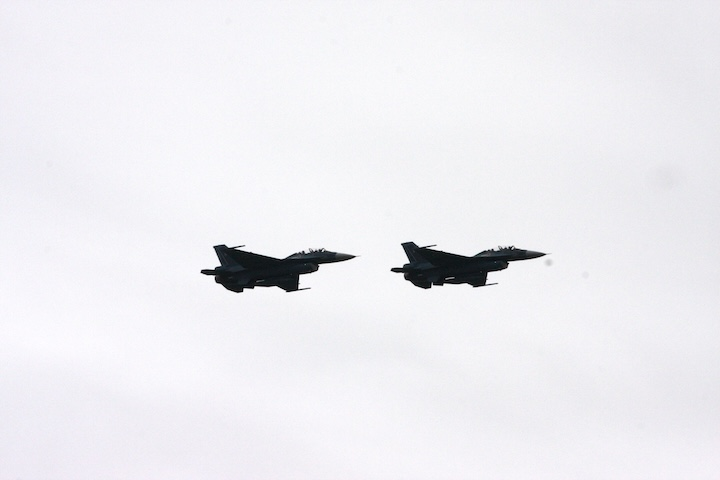
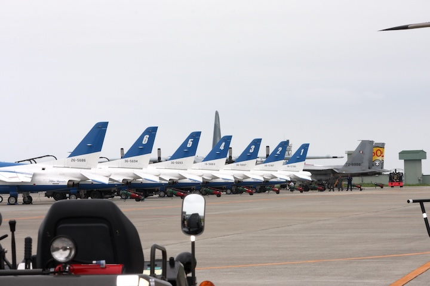
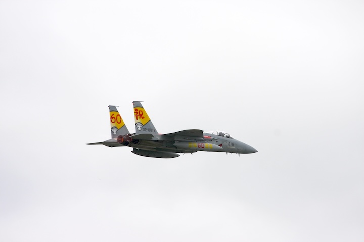
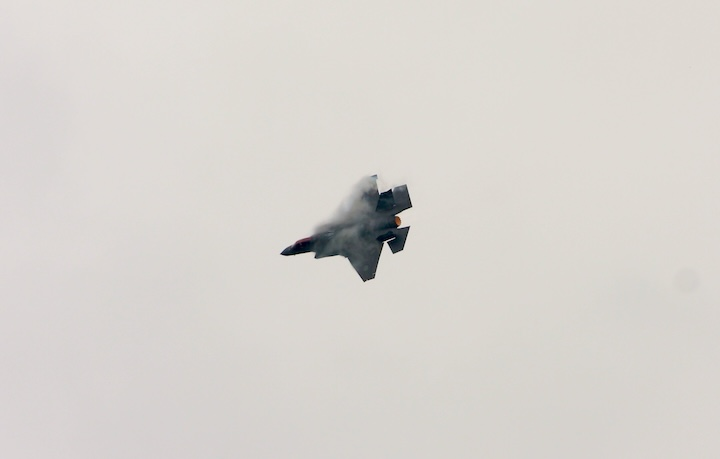
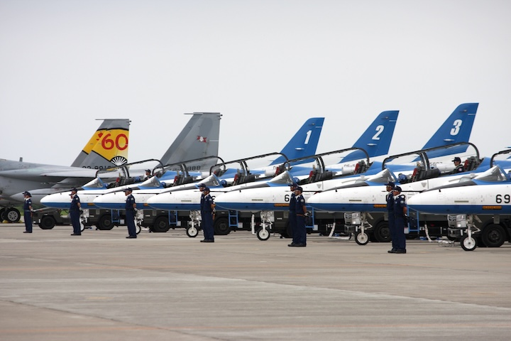
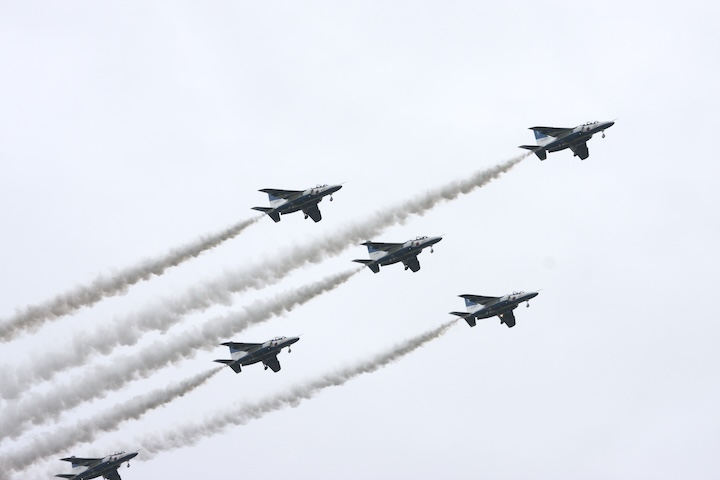
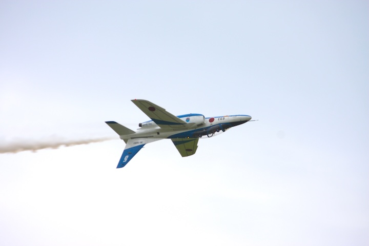
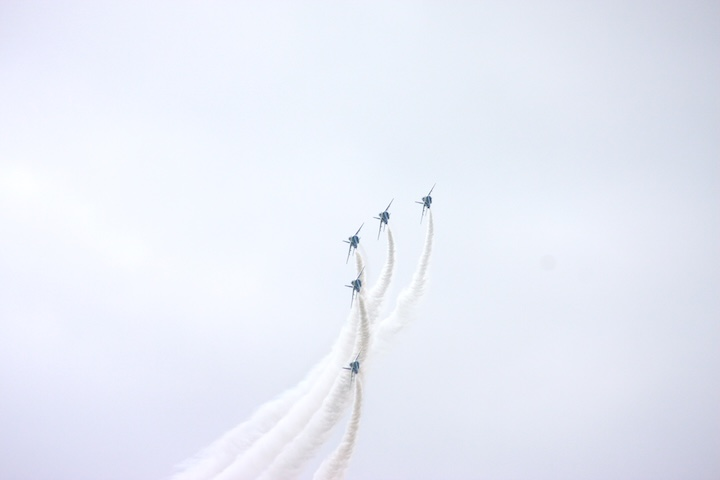
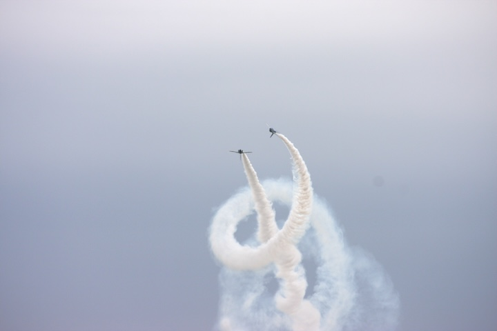
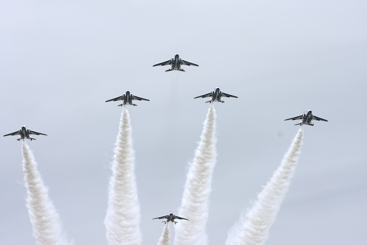

# 6年越しの念願、ついに叶う

宮城県に移り住んで6年。地元の人々から「松島の航空祭は必見だ」と幾度となく耳にしながらも、様々な事情で訪れる機会を逃してきました。しかし2024年8月25日、ついにその念願が叶いました。

仙台の自宅を朝日とともに出発し、バイクで松島基地へ。早朝にもかかわらず、基地に向かう道はすでに航空ファンの車両で賑わいを見せていました。自動車での来場は駐車場不足や渋滞、近隣施設への影響など課題が多いですが、バイクなら基地内に専用駐輪場が用意されており、こうした制約を回避できるのが利点です。

基地に近づくにつれ、集まってくる航空祭に向かう人々の姿。まだ基地の姿は見えなくても、胸の高鳴りは抑えきれません。「今日は何が見られるのだろう」という期待と「あのブルーインパルスを間近で見られる」という興奮が入り混じり、バイクを走らせる手にも力が入ります。

# 航空祭の熱気に包まれて

###### F-2によるオープニングフライト

基地内に一歩足を踏み入れた瞬間、そこには別世界が広がっていました。普段は一般人が立ち入ることのできない自衛隊基地の中は、この日ばかりは老若男女問わず多くの来場者で溢れかえっています。

地上展示エリアでは、通常は遠くからしか見ることのできない様々な航空機を間近で観察することができます。パイロットや整備士の方々が丁寧に機体の説明をしてくれる姿に、彼らの愛機への誇りと自負を感じずにはいられません。

子供たちはコックピットの前で記念撮影をしたり、パイロットから直接サインをもらったりと、目を輝かせていました。「将来はパイロットになる！」と目標を見つけた子供も多いことでしょう。私自身も内心は子供と変わらぬ興奮で、あらゆる展示を食い入るように見つめていました。

# ブルーインパルス：出発から帰還まで見られる贅沢

###### エプロンに整列するブルーインパルスのT-4練習機

航空祭の見どころといえば、何といってもブルーインパルスの展示飛行です。これまでも都市上空での飛行や、他のイベントでの展示飛行を目にする機会はありましたが、松島基地航空祭の最大の特徴は、彼らの「全工程」を目の当たりにできることでしょう。

機体整備から始まり、パイロットたちが整列から機体へと向かう姿、そして整然とエプロンに並ぶT-4練習機の美しい佇まい。離陸前の緊張感漂う瞬間、轟音とともに一斉に滑走路を駆け上がる姿は、映像では決して伝わらない生の迫力があります。

離陸後、上空で隊形を整えてから演技エリアへと向かうブルーインパルス。そして始まる息を呑む展示飛行。完璧な同時性と緻密な計算に基づいた編隊飛行は、まさに「空の芸術」と呼ぶにふさわしいものでした。

青空に描かれる白い航跡と、完璧に揃った機体の動きに、思わず鳥肌が立ちました。非常に近距離で行う編隊飛行の難易度を考えると、パイロットの卓越した技術と長年の訓練の賜物であることが痛感されます。

そして、多くの会場では見ることのできない「帰還」の様子。任務を終え、基地に戻ってきたパイロットたちの清々しい表情や、整備士との握手、そして機体の点検作業まで。ショーの裏側まで見ることができる貴重な機会でした。

# T-4練習機の意外な魅力 — 練習機の枠を超えた戦闘機魂

###### 編隊飛行を披露するT-4練習機

ブルーインパルスが駆るT-4は「中等練習機」というカテゴリーに分類されます。最高速度マッハ0.9（約1,100km/h）、全長13m、全幅9.9mの比較的コンパクトなジェット機です。一般的に練習機というと、本格的な戦闘機への踏み台という印象を持つ方も多いでしょう。しかし、目の前で繰り広げられるその機動性は、そんな先入観を木っ端微塵に粉砕するものでした。

洗練された空力設計のフォルムと相まって、その俊敏な動きは観客を釘付けにします。特に低空での機動飛行は、コックピット内のパイロットの緊張感まで伝わってくるような臨場感で行われ、その精密な技術と冷静な判断力に思わず息を呑みました。

また、T-4のエンジン音も特筆すべき魅力の一つ。F-15やF-2のような轟音とは一線を画する、研ぎ澄まされた高音域の響きは耳に心地よく、航空機それぞれの「声紋」の違いを堪能できる貴重な機会となりました。

# 多彩な戦闘機の競演 — 日本の空を守る翼たち

###### アフターバーナー全開のF-15戦闘機

航空祭のもう一つの圧巻は、実戦配備されている様々な戦闘機の展示飛行です。この日は、松島基地所属のF-2A/B戦闘機（最高速度マッハ2.0、全長15.5m）、千歳基地から飛来したF-15Jイーグル（最高速度マッハ2.5、全長19.4m）、そして三沢基地のF-35Aライトニングll（最高速度マッハ1.6、全長15.7m）という、日本の空を守る主力3機種が揃い踏みしました。

中でも息を呑んだのはF-15Jの機動展示です。アフターバーナー全開での急上昇は、22トンもの推力が垂直に空を切り裂く圧倒的存在感。積み重ねた訓練の成果か、パイロットは機体を自分の身体の一部のように操り、その後の鋭角な急降下と超低空飛行の組み合わせは、まさに戦闘機の極限性能を目の当たりにする体験でした。轟音と共に眼前を駆け抜けるF-15Jに、体内のアドレナリンが一気に放出されるのを感じました。

また、日本の誇るF-2支援戦闘機の洗練された飛行も圧巻でした。青空に映える特徴的な「空自ブルー」の機体は、日本の航空技術の結晶。F-16をベースにしながらも日本独自の改良が施され、全幅はF-16より約3m広く、日本の防空任務に適した設計となっています。その精密な飛行性能と優美なフォルムに、国産技術の高さを再認識させられました。

一方、未来の主力となるF-35Aは、その特徴的な低騒音と独特のシルエットで存在感を放ちました。ステルス性を重視した設計は一目瞭然で、通常の戦闘機とは明らかに異なる佇まい。次世代の航空戦を担う最新鋭機の姿に、多くのカメラが向けられました。日本の防衛力の新たな核となる戦闘機の飛行を目撃できたことは、航空ファンとして貴重な経験となりました。

###### 青森から飛来したF-35戦闘機

# 運命の展開 — 予期せぬアクロバット飛行の感動

###### 厳格な姿勢で整列するブルーインパルスのパイロットたち

松島基地航空祭では通常、午前と午後の2回ブルーインパルスの展示飛行が行われます。ブルーインパルスには大きく分けて、複数の編隊形態で基地上空を通過する**「ローパス」**と、機体性能の限界に挑む**「アクロバット飛行」**の2種類があります。

この日の午後のプログラムは当初、アクロバット飛行の予定でしたが、突如「上空の視界不良のため、ローパスへ変更」というアナウンスが場内に響き渡りました。会場内に一瞬の失望感が漂う中でも、「それでも見られるだけでラッキー」という前向きな声が聞こえてきました。

###### 整然と編隊を組み、基地上空を旋回するT-4群

離陸後、6機のT-4は予定通り2度のローパスを披露。しかし直後、機体は空域を離れ、上空での待機態勢に入りました。「何が起きたのか？」という緊張感が会場を包む中、再びアナウンスが入ります。

「視界良好となりました。ブルーインパルス、アクロバット飛行を行います」

その瞬間、会場内の空気が一変。期待と興奮の歓声が沸き起こり、まるで野球場でサヨナラホームランが飛び出した時のような熱狂に包まれました。

###### 5番機の代名詞背面飛行

いざ始まったアクロバット飛行は、ローパスとは比較にならない圧倒的迫力で観客を魅了しました。特に5番機の単独背面飛行は、パイロットが重力と闘いながら機体姿勢を完璧に制御する高度な技術の結晶。

###### アクロバット飛行の最中]

そして最後を飾ったのは、ブルーインパルスの象徴とも言えるコークスクリュー。6機が螺旋を描きながら上昇していく姿は、まさに空中彫刻。青空に描かれる白い航跡は、やがて消えゆく芸術作品のようでした。

###### 会場の歓声を一身に浴びる圧巻のコークスクリュー

# 空に刻まれた感動 — 一生忘れられない航空祭の記憶

灼熱の太陽の下、約6時間にわたって繰り広げられた松島基地航空祭は、期待を遥かに凌駕する感動と興奮の連続でした。目の前で轟音と共に駆け抜ける戦闘機の生命力、精密な技術の結晶であるブルーインパルスの編隊飛行、そして予期せぬドラマチックな展開——これらすべてが、単なる「見物」を超えた魂を揺さぶる体験となりました。

特に印象的だったのは、各機体の「個性」です。F-15Jの圧倒的なパワーと存在感、F-2の洗練された技術と美しさ、F-35Aの未来感、そしてT-4の驚異的な機動性と精密さ。それぞれが異なる魅力を放ちながらも、共通して感じたのは「日本の空を守る」という強い信念と誇りでした。

また、普段は目にすることのできないパイロットや整備員の姿、彼らの真摯な表情や所作からは、日々の厳しい訓練と任務への献身が伝わってきました。青空を舞台に繰り広げられる彼らの技と魂は、写真や映像だけでは決して伝わらない、生で体感してこそ価値のあるものだと実感しました。

6年越しの念願だった松島基地航空祭。「行って良かった」という言葉では到底表現しきれない充実感と共に、基地を後にしました。来年はどんな感動が待っているのか、どんな新たな出会いがあるのか——もう既に次回の航空祭へのカウントダウンが始まっています。

###### 松島基地航空祭は最高だった

