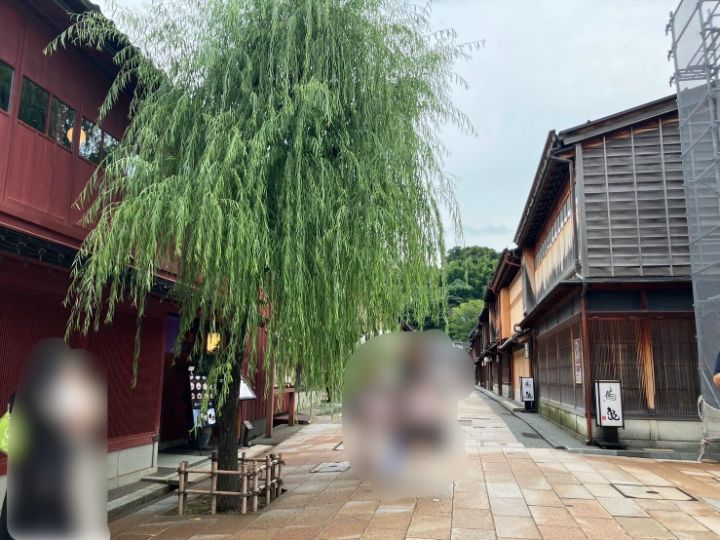
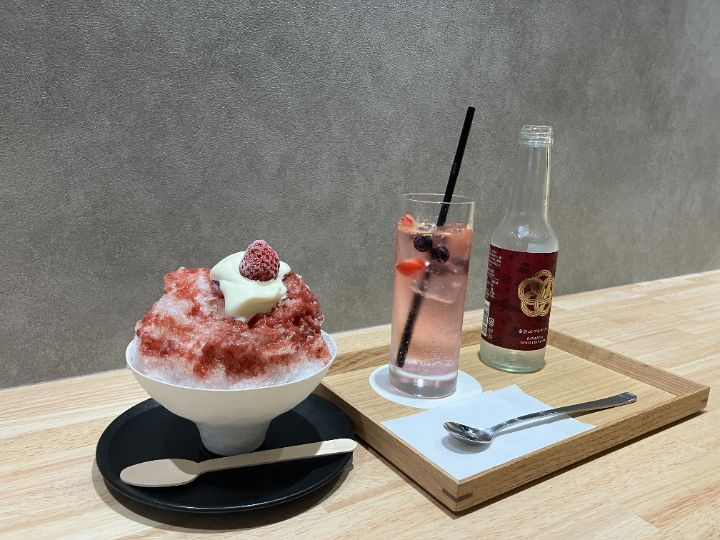
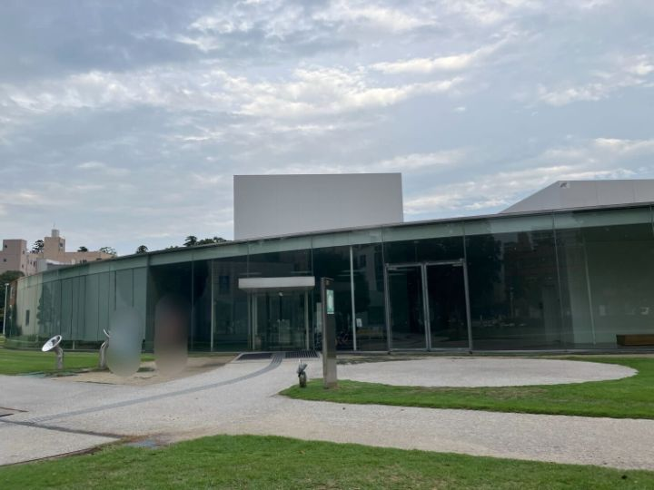
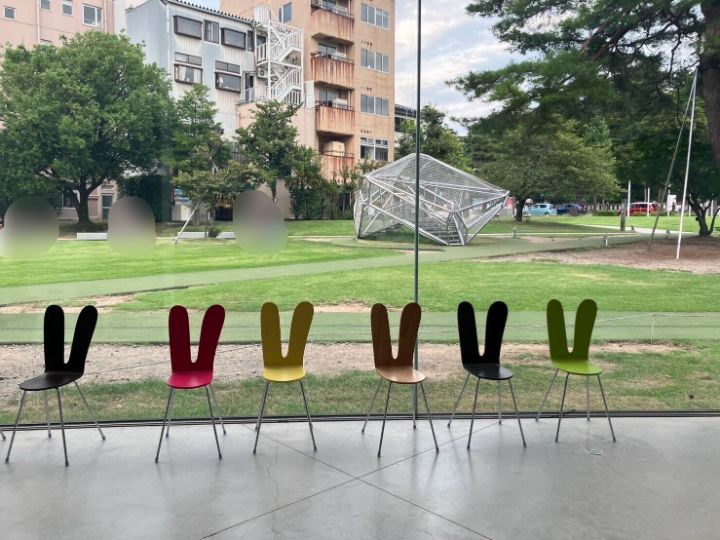
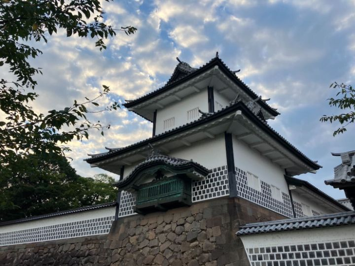
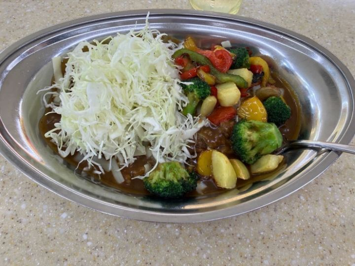
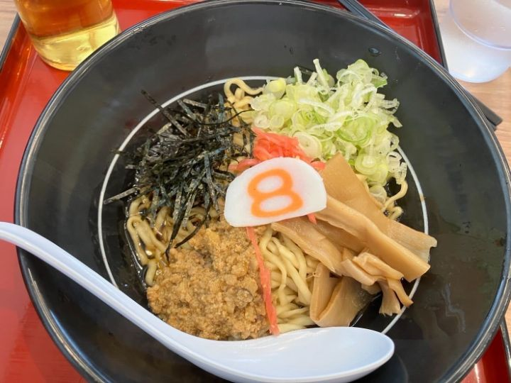

# 金沢を満喫しました

少し早めに金沢へ向かい、主要観光地を回ってきました。

## 茶屋街

始めに茶屋街に行き、伝統的な街並みを堪能しました。

**金箔**サイダーと、自家製シロップのかき氷です。名産品の金箔を使用した食品も多く販売されていました。

## 21世紀美術館

美術館内部だけでなく、外にも体験型の展示があり、未来を感じました。

**ウサギの椅子**がかわいかったです。

## 金沢城

とても広い敷地で、景色も綺麗でした。**加賀百万石**の力を感じられたような気がします。あまり時間がなかったので、再訪してじっくりと見て回りたいです。

## グルメ

金沢といえば、**ブラックカレー**。学会のお昼休みに狩川先生と一緒にいただきました。カツを乗せるのが王道ですが、野菜とルーの相性も良く、あっという間に食べ終えてしまいました。ごちそうさまでした。

こちらは北陸のソウルフードと名高い**８番らーめん**。おいしすぎて３泊４日の中で２回行きました。ほかの味も食べてみたいです。

## 最後に

街並みがとてもきれいで、美味しいご飯も多く、学会参加の活力につながったと思います。
