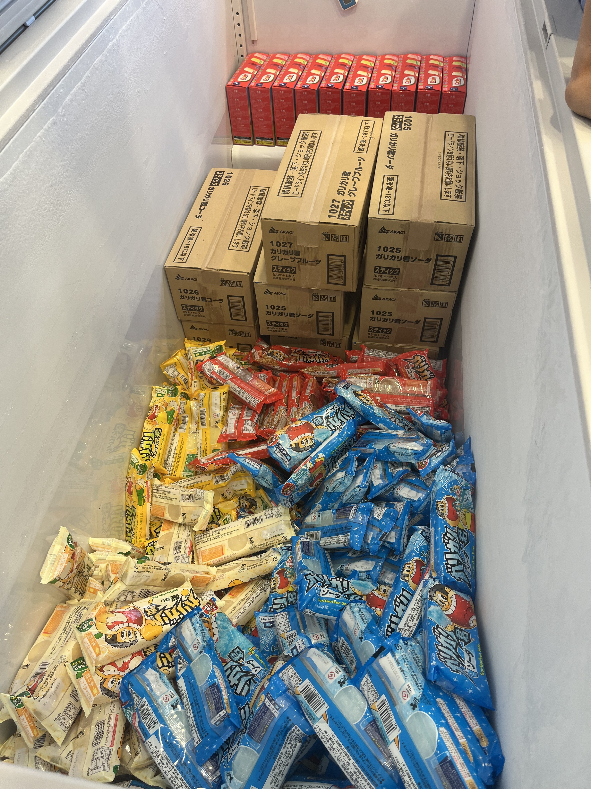
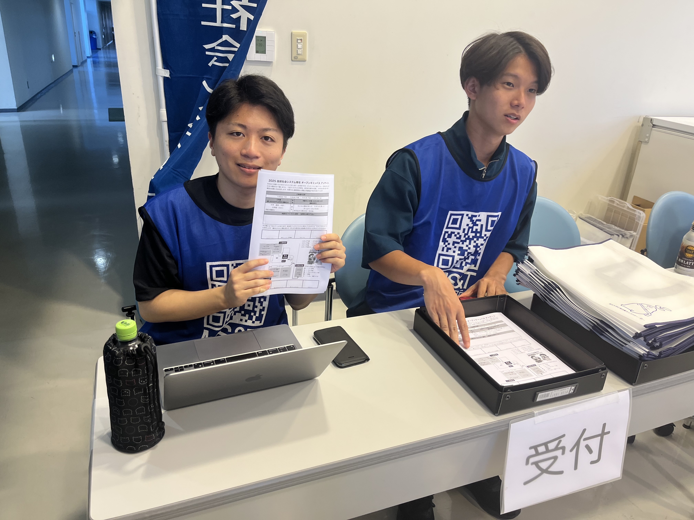
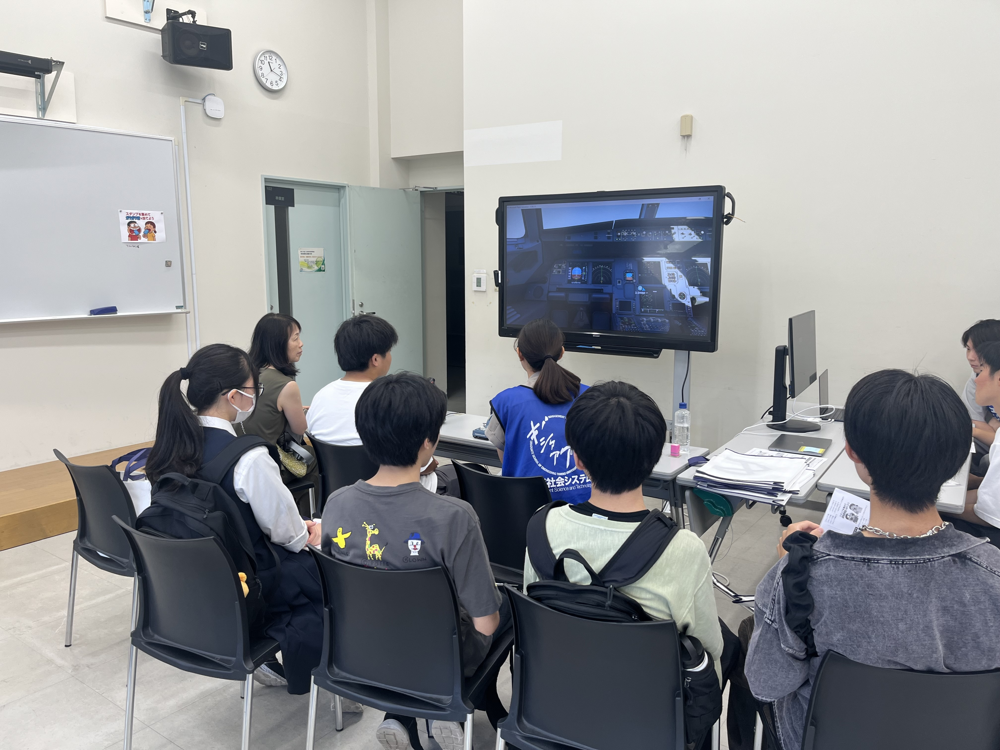
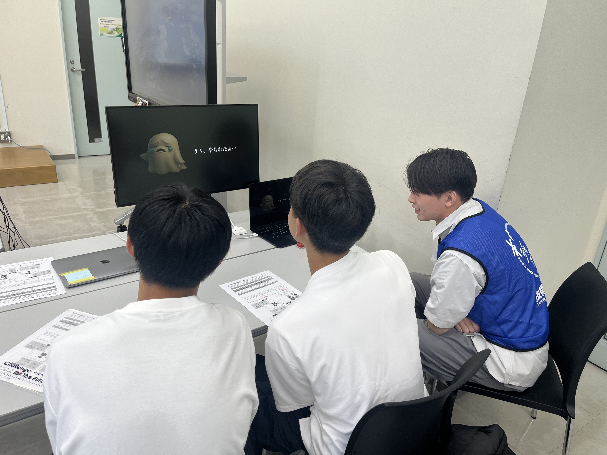
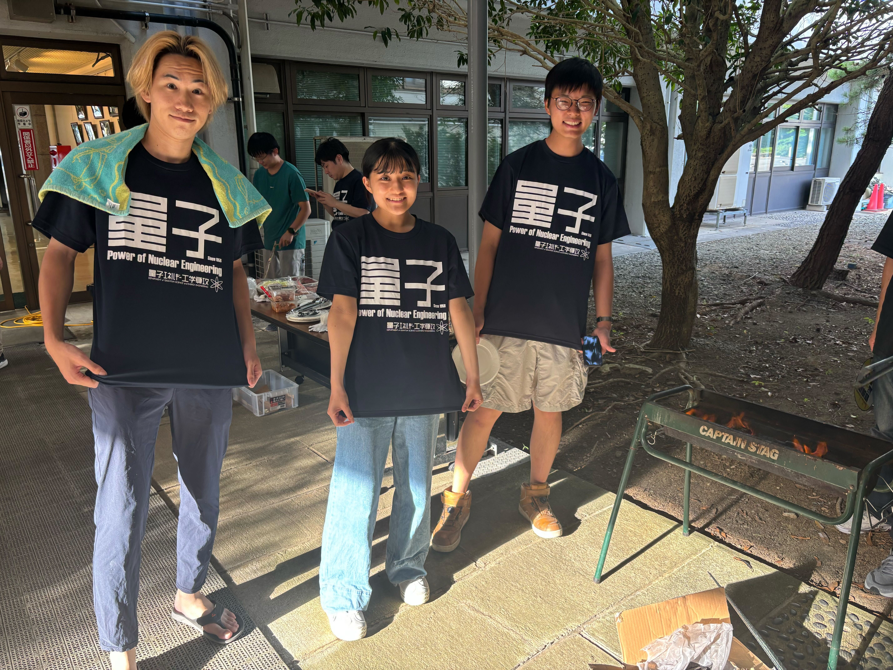
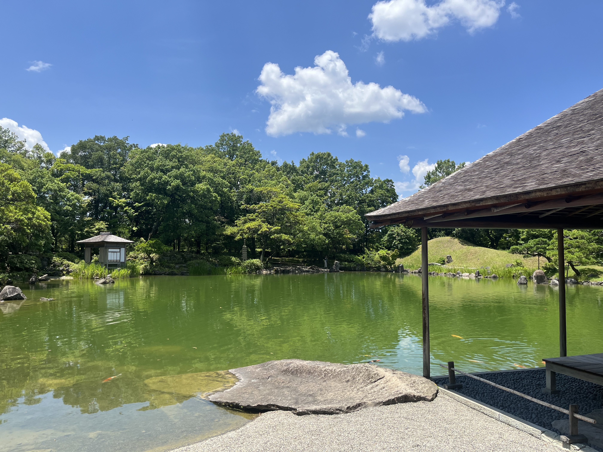

こんにちは。
M2の鈴木です。
最近は梅雨も明けて、暑い日が続いています。
仙台は他の地域よりは比較的涼しいと思っていましたが、そんなことはなく暑かったです。

ということで、７月の研究室ブログを見ていってください！

# 新３年生の自己紹介

今回、研究室に配属となった３年生に自己紹介をしてもらいます。
頼もしい後輩が来てくれてとても嬉しく思います！

## 金子 さくら

北海道出身です。
カラオケとダーツが趣味で、時々出没します。
よろしくお願いします！

## 森下 竜太郎

野生動物が出没する山形の田舎高校出身です。
最近はYouTubeを始めようか悩んでいます。
よろしくお願いします！

## 小橋 川博尊

B3の小橋川博尊（こばしがわひろたか）です。
熊本から来ました。
読書とゲームが好きなインドア派です。
よろしくお願いします。

[!CUSTOM] blue thumbsup ようこそ！高橋狩川研究室へ！

# オープンキャンパス

とうとうこの季節がやってきました！
**オープンキャンパス**
今年は7/30〜31で実施しました。
とても暑い中、多くの人が本研究室のブースに来ていただけて本当に嬉しかったです。
ありがとうございました！！

下に、オープンキャンパスの様子を載せます。

q
食欲をそそる大迫力の景品アイス

受付を頑張る宮本くんと今井くん

大盛況のフライトシミュレータ体験

イライラの止まらない、最恐！使いにくいインターフェースの館

量子のブースで頑張ってるB４の学生

# おまけ

私ごとではありますが、この前のHI学会後に**プチ福井旅行**をしました！
滞在時間は短かったですが、行った場所を紹介します。

### 福井県庁

この福井県の県庁は、珍しく城跡の中にあります。
城跡の中は歩くことができ、結城秀康公の像がありました。
なんとも言えない感じの顔をしていましたね。

### 養浩館庭園

次に _名勝 養浩館_ に行きました。
ここはコンパクトながらも良く整備されている綺麗な空間でした。
自然が好きな人には非常におすすめです！

少ないですが、プチ観光でした。
福井駅周辺はすごく良い雰囲気で、歩いているだけでも楽しかったです。
帰りは、お土産に羽二重餅を買い、越前そばを食べて帰りました！
次に福井に来るときは、恐竜博物館とかに行きたいですね。

７月のブログは終わりです。
また来月〜
