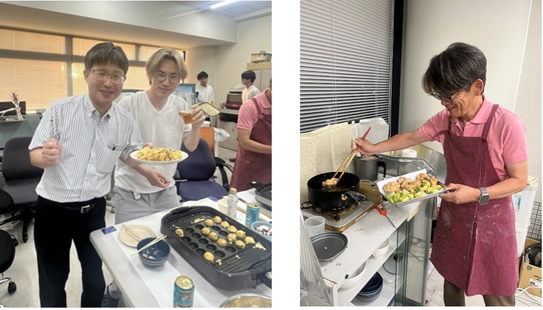
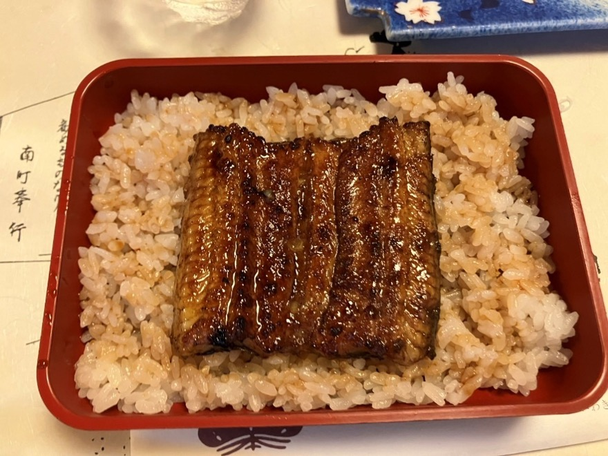

初めまして。この春から研究室に来たM1の日下です。
最近暑くなってきたので、ついアイスに手が伸びてしまいます。

私のNo.1アイスは宇治金時のかき氷です。皆さんのおすすめは何でしょうか。

# 新3年生の歓迎会

新しく学部3年生が3名入ってきてくれました。フレッシュな若さを感じます。

研究室で歓迎会を開催しました。
狩川先生がたこ焼き、高橋先生がお好み焼きとからあげを作って下さり、3年生との仲も深まったように感じます。
(残念ながら私は参加できませんでした。代わりに写真を撮ってくださった方、ありがとうございます！)

# いわき

学生３人と高橋先生でいわきを訪れ、共同研究先の企業の方々とミーティングと親睦会を行いました。
社内設備の見学などもさせていただき、研究を進める上で大変重要な知見を得ることができました。
親睦会では、ウナギを食べました。ふっくらとした身に甘じょっぱいたれが絡み、個人的には人生で食べたウナギの中で最も美味しかったです。

# 最後に

ここまでお付き合いいただき、ありがとうございます。
７月にはオープンキャンパスも開催されるので、高橋・狩川研究室に興味がある方もまだない方もぜひいらしてください！研究室一同、青葉山でお待ちしております。
