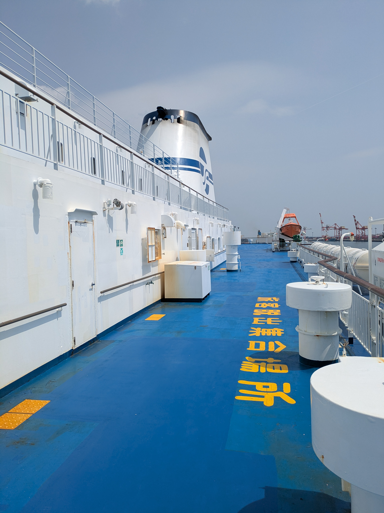
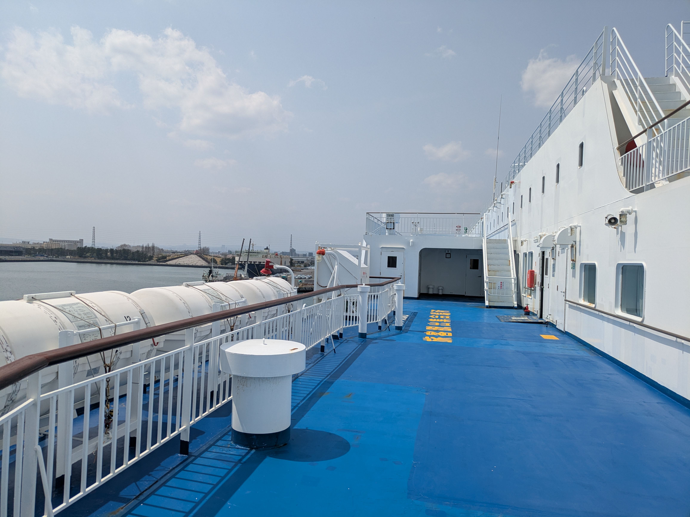
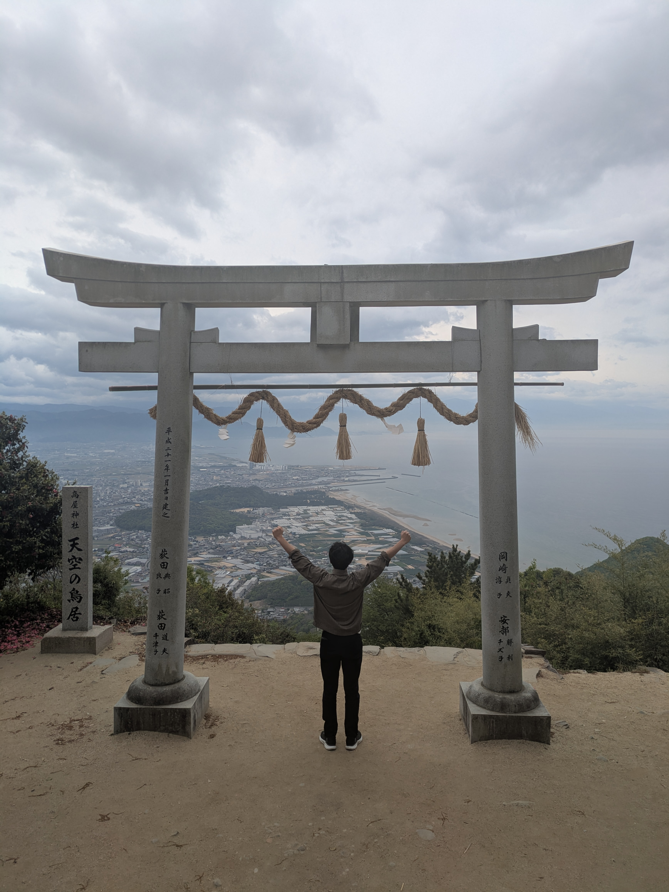
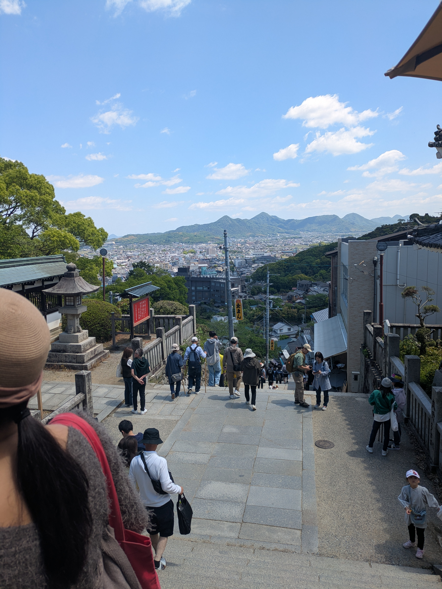
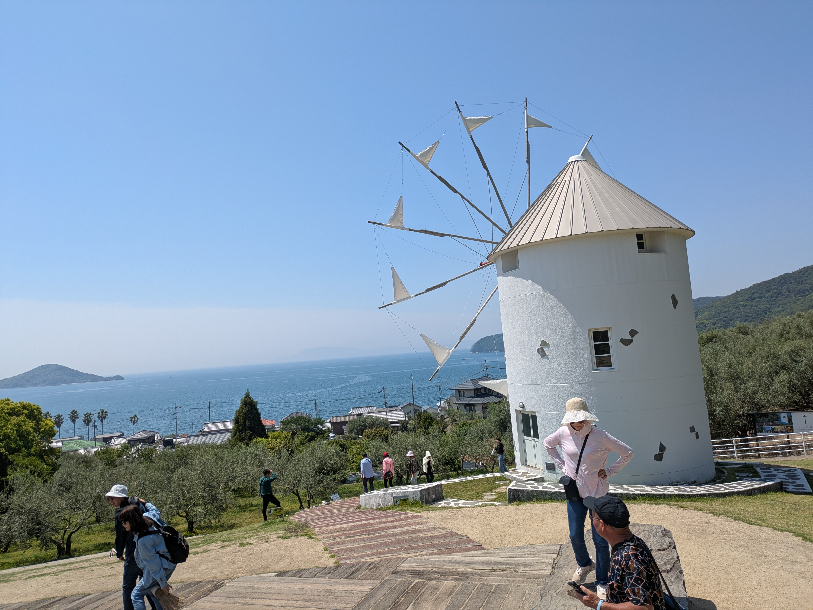
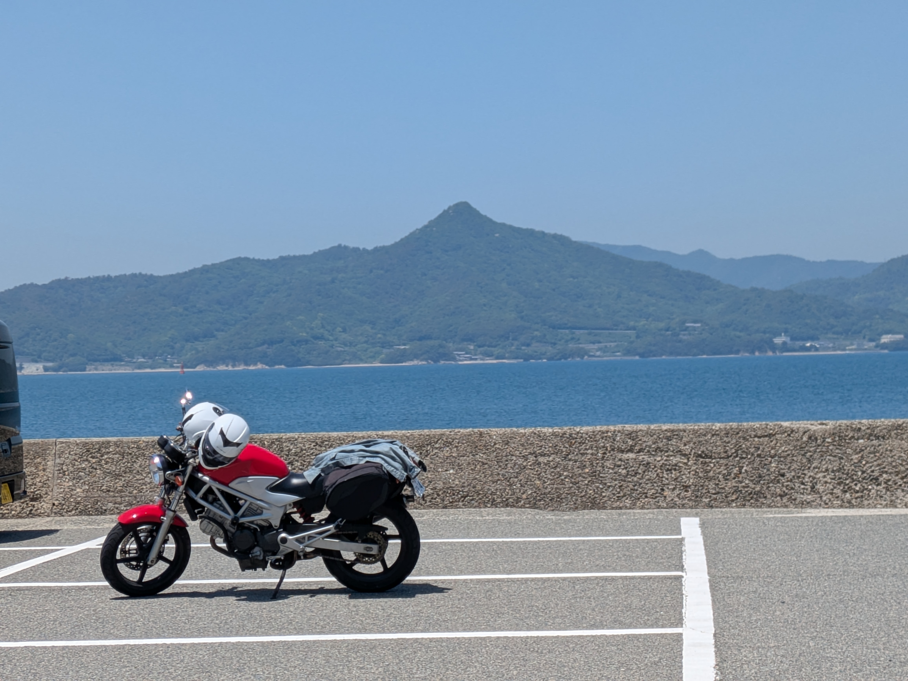
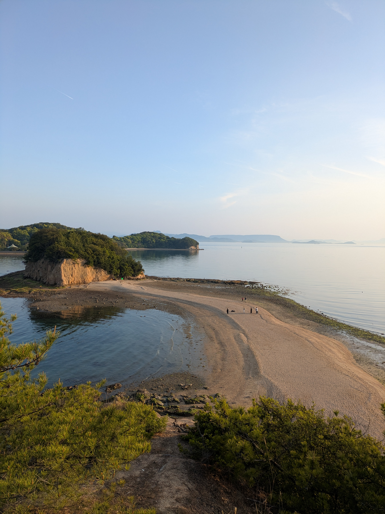
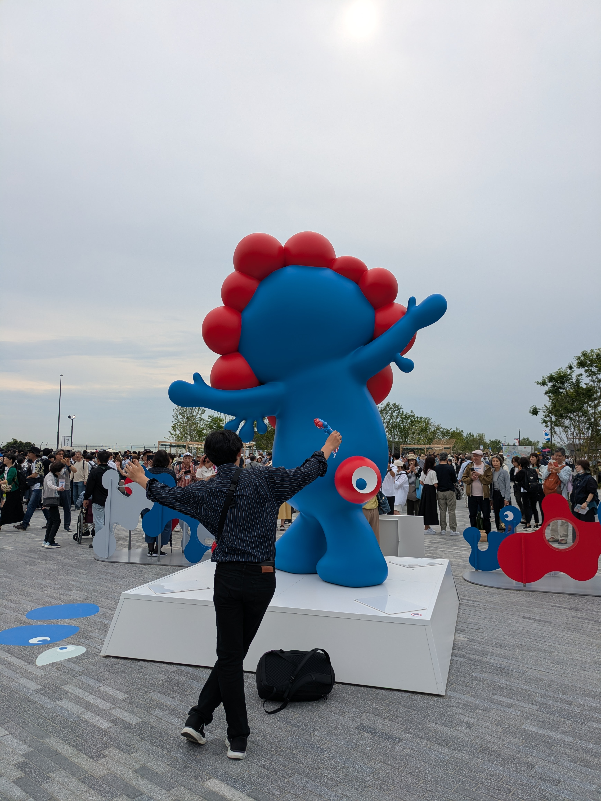
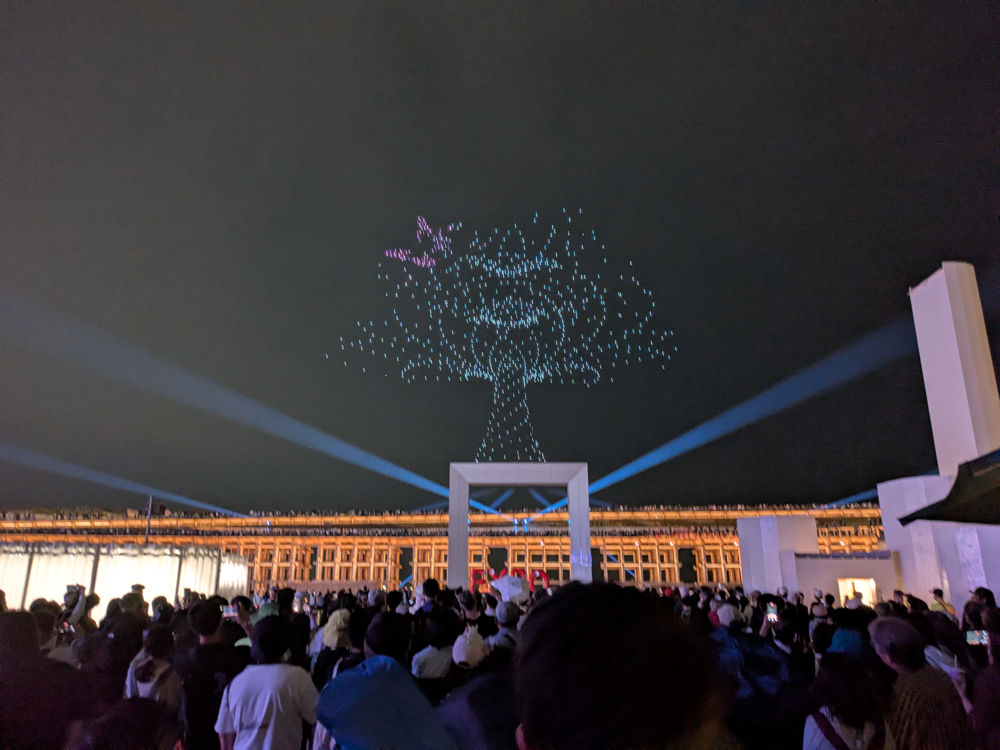

# はじめに

お久しぶりです。3月に卒業した嶋貫です。

元々今年の3月にブログ担当としてブログを書く予定だった私ですが、
「ぶっちゃけ卒業式終わって、黙ってれば書かなくていいんじゃない？」
と思い卒業してからブログのことを忘れて遊んでました。

しかし、次期ブログ担当の大三川くん含め優秀な後輩たちは私を見逃してくれず、
最近ブログの催促が増え始めてきました。
大分時間が過ぎましたがもう逃げきれないと思ったため観念してブログを書かせていただきます。

研究室の追いコンの写真とかそんなもっていないので
卒業してからのリゾバ体験記と大阪万博について書きたいと思います。

# リゾートバイト in 香川

リゾバの経緯を説明すると卒業後、就職しなかった私は2か月ほどNEATとして過ごす時間があったので、お金稼ぎと観光を兼ねて香川県の遊園地のリゾートバイトに応募しました。
なんで香川かというと、四国行ったこと無かったし、瀬戸内国際芸術祭という5年に一度のイベントにも行きたかったので選びました。
下の画像は香川へ向かう途中のフェリーです。

## 香川へ向かうフェリー

フェリーの中には、ゲームコーナーとか映画館とかあって思ったよりも快適でしたね。
~~ゲームコーナーのスロットは良い設定入って無かったです~~

## 香川観光記

香川に着いてから遊園地で4週間程働いた中で、結構やらかしたり色々あったのですが、どこまで書いていいのかよく分からんので、休みの日や終わった後に香川で行った観光地に着いて書こうかなと思います。
色々回ったので、全部書くと長くなるのでおすすめ観光地だけ書きます。

## 天空の鳥居

これは結構凄いですね。山の上にある神社なんですけど、香川の街並みと瀬戸内海の両方を同時に堪能できるし、めちゃめちゃ写真映えするので景色の綺麗なところへ行きたい人はぜひいって欲しい！
ただ、車で相当上ったあと、徒歩でもまあまあ登るので日頃運動していない人には大変ですがそれに見合う景色が見れます。

## 金刀比羅宮（こんぴらさん）

こんぴらさんで有名な金刀比羅宮です。香川でも有名な観光地のため、結構人がいます。
金刀比羅宮にお参りするためには780段以上の階段を登らなきゃいけないので相当きついです。だいたい総合研究棟の一階から高橋狩川研までの階段の４倍くらいあります。
しかも階段の途中から何故か自販機がなくなるので疲れても水分補給とかできなくなります。
正直、登るのが大変なのであんまりおすすめはできませんが若いうちに行っといた方がいいですね。階段の下の方はうどんの作り方を教えてくれるうどんの学校とか、商店街が並んでるので疲れる前に散策しとくといいと思います！

## 父母ヶ浜

瀬戸内の島含めないんだったら観光地でダントツの一位です。
香川に来たらとりあえず夕方に寄っておけばいいです。香川県の西側にある砂浜ですが、干潮時には海の水が引いてかなり奥まで歩いていけるようになり、砂浜に溜まった海水に夕日が移るのでものすごく綺麗です。こんぴら行ってからここに来るのが定石みたいで午前中にこんぴらですれ違った人は大体夕方ここにいます。

## 小豆島

本観光で一番行きたかったとこです！ここをバイクで走るためにわざわざ山形からバイクを運んできました笑
小豆島は瀬戸内海の島の一つで乾燥した気候をいかしてオリーブ畑があることで有名です。
また、ヨーロッパに似た街並みから魔女宅の舞台のモデルになったといわれています。　
瀬戸内海の海沿いを青空の中、爆走するのは最高でした。また、干潮時はエンジェルロードという干潮時のみ現れる道で行ける島もあります。
島特有のゆったりとした雰囲気と瀬戸内国際芸術祭の現代アートが独特で他の観光地にはない面白い場所でした。

香川は基本的に天気が良いので景色がいいところがほんとに多いです。瀬戸内海の景色や島の雰囲気は他県にはない魅力的な場所でした。
あと、うどんが美味くてものすごく安いので帰ってきて丸亀製麺行って「うどん高っ」てなります。
卒業旅行とか夏の学校の行く場所が決まって無かったら「香川」候補にいかがでしょうか。

# 大阪万博のすすめ

香川から帰ってくる途中に大阪万博に寄ったのでそのことについて書こうかと思います。
大阪万博は、工事がどうとか虫がどうとか色々ネットとかで言われていますが、正味行った方がいいです。**すっっっっごい楽しかった！！**

正直自分もそんなに大阪万博そんなに乗り気じゃなかったんですけど行ってみるとテンション上がってました。

浮かれて調子乗ってます。

## ミャクミャク

色々パビリオンありましたけど、行った中でのおすすめは「PASONA NATUREVERSE」と「アメリカ館」です。PASONAは実際に動いているIPS心臓が生で見れるのに加えて、30分に一回液晶のキューブで行うショーがあるのですが、それが凄い迫力ありました。他のパビリオンと比べてもかなり見ごたえがあります。
~~あとどうやら〇渡君の姉が働いているらしい、、、~~

## PASONA

アメリカ館も大きな部屋にフルスクリーンでロケットの発射を体験できる展示があるのでかなり見ごたえがあります。月の石はほんとに写真一枚撮ったら終わりなので、あんまり見れないし見たら普通の石なんで月の石を見る直前が多分一番テンション高いです。

## アメリカ館

あと万博の最後に噴水ショーとドローンショーをするのですがこれが最高に良い。。
空中に数百機のドローンが飛んでるのがほんと綺麗でした。これだけでも入場料分の価値あります。絶対見た方いいです。

## ドローンショー

万博は色々でかいので会場とか大屋根リング歩いてるだけで結構楽しいです。
ただ、人めっちゃ多いのとちゃんと準備しないと予約は一切取れないのでしっかりと準備した方が楽しめると思います。

空飛ぶヘリ（飛ばない）が展示されてたので一応載せます。

## 空飛ぶヘリ

こんな感じで２か月間は同期が汗水垂らして働いている間遊んでましたごめんなさい。
けど結局リゾバで稼いだお金の半分以上観光で無くなったので、今度同期に会った時は社会人のみんなにご飯奢って貰おうと思います。

高橋・狩川研の皆さんも研究が本格的に忙しくなる前に是非万博へ。

P.S. 3年間お世話になりました。愉快な先輩・同期・後輩そして教授方のおかげでとても楽しい大学生活を送れました！ありがとうございました！
大三川くん、頑張って高橋研ブログ更新し続けてください！

> [!CUSTOM] sky smiley 感謝のひと言
> 卒業後にも関わらず、充実した素敵なブログをありがとうございます！(空飛ぶヘリは当たり前な気がしますが...)
