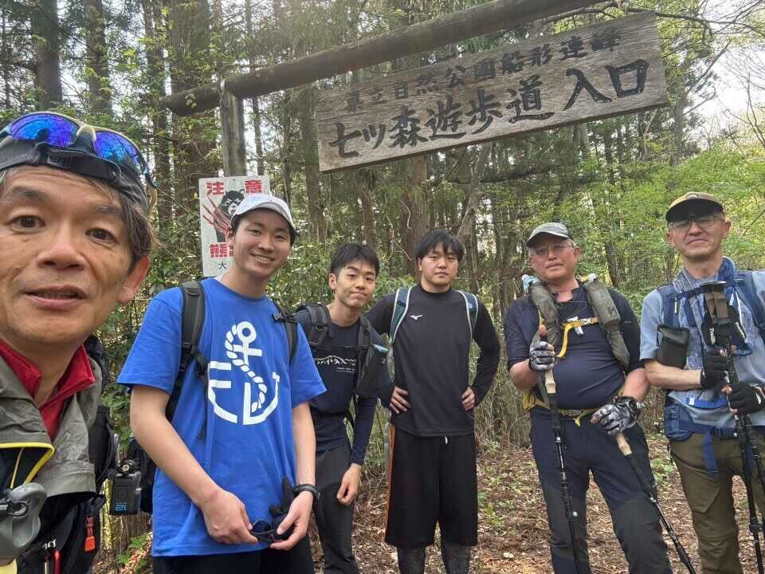
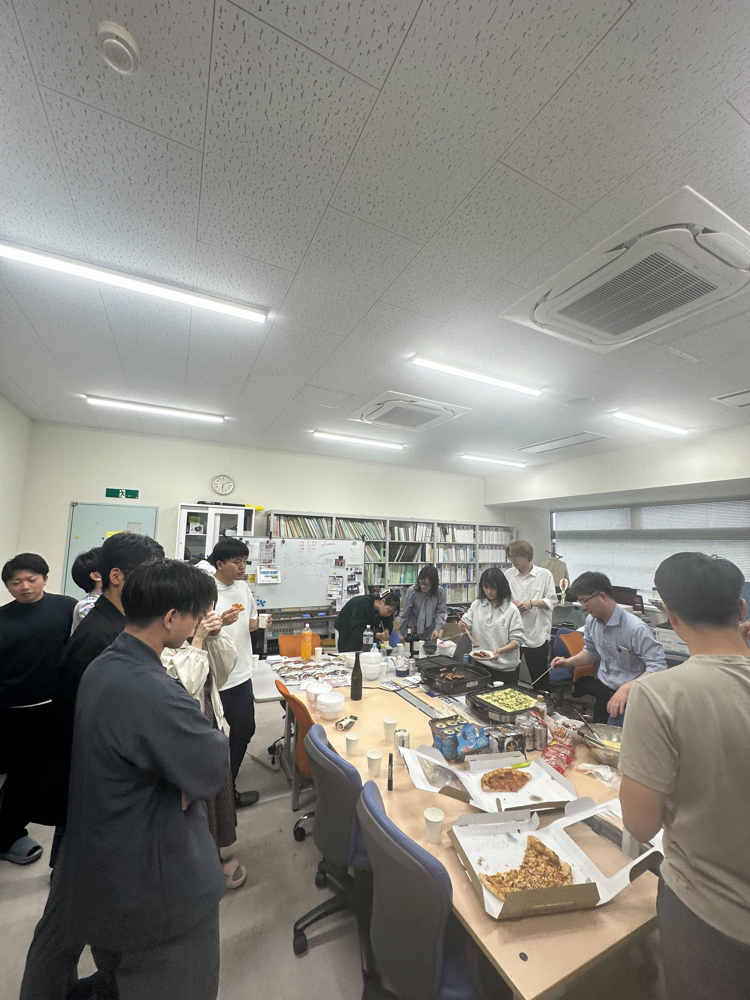

# はじめに
初めまして。今春から埼玉から仙台へ来たM1の國政です。仙台は**街がコンパクト**でとても住みやすく、山に登るなど充実した日々を過ごしています。

# 中間発表 
5月9日、技術システム工学専攻のM2が中間論文発表を行いました。発表者の皆さん、お疲れ様でした。ゴールデンウィーク直後という厳しいスケジュールの中でも、素晴らしい発表で大変勉強になりました。

# 山形 
今年から始まる共同研究のキックオフミーティングのため、M1と高橋先生の4人で山形へ行きました。現場の声を直接聞けたことで課題をより具体的に理解でき、研究のイメージが明確になってきました。

# 歓迎会 
4月から新たに研究室に加わった4名の歓迎会を開いていただきました。ホットプレートで作る出来立てのたこ焼きは絶品でした。 その後、巨大モニターで恒例のGoogle Earthでのお宅訪問をするなど、大いに盛り上がりました。

> [!CUSTOM] sky smiley 狩川先生・B4の方々へ
> ご準備ありがとうございました。とても楽しかったです！

# 終わりに 
6月は9月卒業予定の方の予備審査やB3の歓迎会などが予定されています。梅雨の時期ですが、頑張りましょう。
