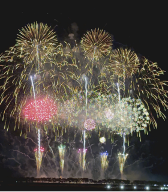
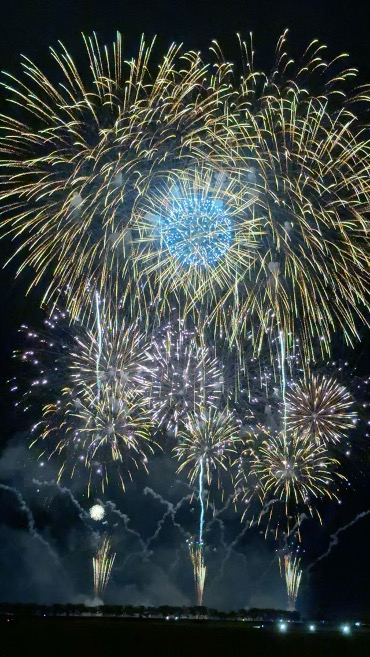
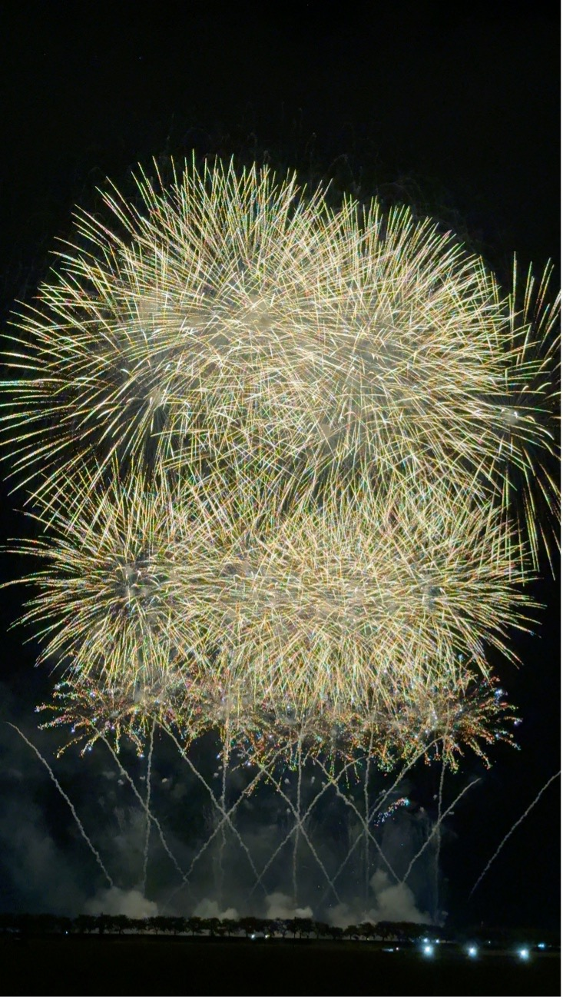
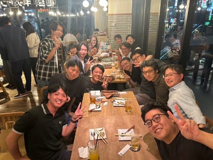
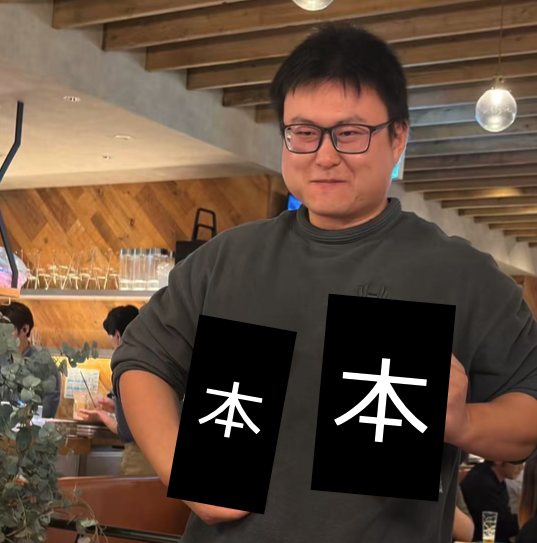
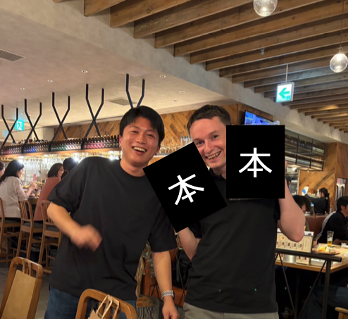

# 第97回大曲花火大会に行ってきました

8月末、研究室のメンバー有志で秋田県大仙市で開催された「第97回全国花火競技大会（大曲の花火）」に行ってきました。今年で第97回を迎えたこの大会は、1910年（明治43年）に諏訪神社の祭典の余興として始まった「奥羽六県煙火共進会」を起源とし、100年以上の歴史を誇る由緒ある花火大会です現在では毎年全国から70万人以上の観客が集まる、日本最高峰の花火競技大会のひとつとなっています。
当日は朝から多くの観客が雄物川河川敷の会場に集まり、私たちも昼頃には現地入りして場所取りを敢行しました。真夏の日差しにじりじり照りつけられつつも、お祭り気分で屋台のきりたんぽやかき氷を楽しみながら開始を待ちます。夜7時、いよいよ競技花火がスタートすると、そんな暑さも吹き飛ぶほどの大迫力！次々と夜空に開く大輪の花火に、思わず「おぉ～！」と歓声を上げてしまいました。大玉が炸裂するたびに体にまで響く衝撃は、ある意味腹筋に効いてしまうのでは…と思うほどでした。
今回の花火大会では、全国各地から集まった選りすぐりの花火師たちが趣向を凝らした花火を競い合い、その芸術性にも大いに感動しました。音楽と完全にシンクロしたワイドスターマインや、ハート型・キャラクター型に開く創造花火など、大空に描かれる光のアートに大興奮！最後は大会提供の超特大スターマインで夜空が真昼のように明るくなり、フィナーレでは思わず拍手喝采でした。なお、本記事に掲載した最初の3枚の写真はいずれも今年の大会で撮影した花火です。その巨大さと芸術性の一端でも伝わっていれば幸いです。

# 9月卒業メンバーの追いコン開催！

そして先日、研究室では9月卒業予定のメンバーである姜さんとジョーダンさんの追い出しコンパ（追いコン）を開催しました。教授、准教授、助教、秘書さんを含む研究室メンバーが参加し、お二人の門出を盛大にお祝いしました。当日の集合写真は皆とても良い笑顔ですね。

追いコン恒例のプレゼント贈呈タイムでは、まず姜さんにサプライズギフトを渡しました。姜さんには大好きな“ウサギ”にちなんだユニークな本をM2のチョイスでプレゼント。[^1]
[^1]:本は諸事情により、表紙を隠してあります。

写真で姜さんはプレゼントを手にニッコリですが、少し照れくさそうでしょうか？喜んでもらえたようで何よりです。

続いてジョーダンさんにもプレゼントを贈呈しました。ジョーダンさんにも日本文化に関わる本をこれまたM2のチョイスで用意していたのですが、こちらも大ウケ！写真からも、ジョーダンさんの満面の笑みと「やられた～！」という嬉しい驚きが伝わってきます。[^2]

[^2]:こちらも同様に表紙は隠してあります。

改めて、姜さん、ジョーダンさん、ご卒業おめでとうございます。当日は笑いあり涙ありの追いコンとなり、研究室一同、お二人との別れを寂しく感じつつも、その新たな門出を笑顔で送り出しました。これからの更なるご活躍を心よりお祈りしています！
