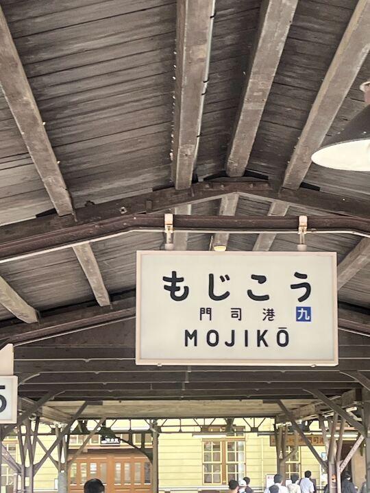
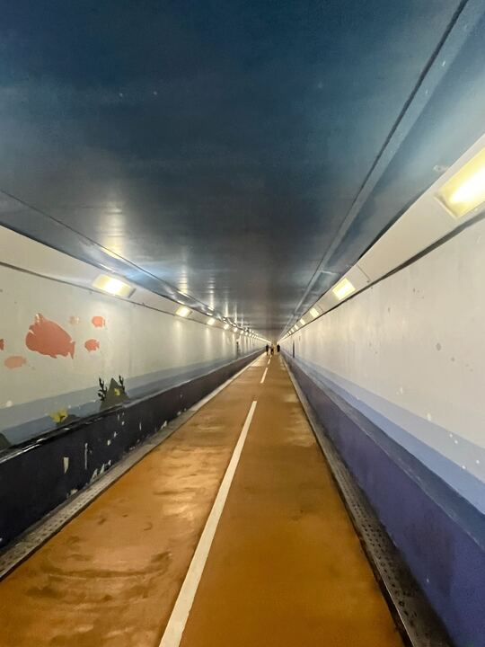
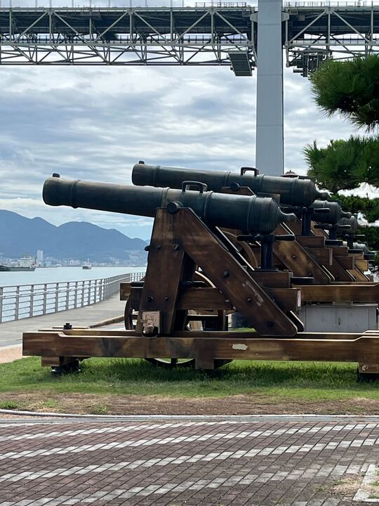
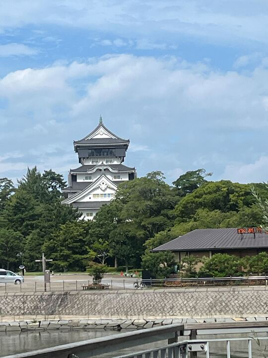
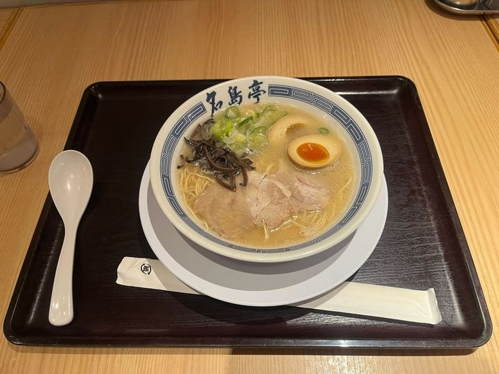
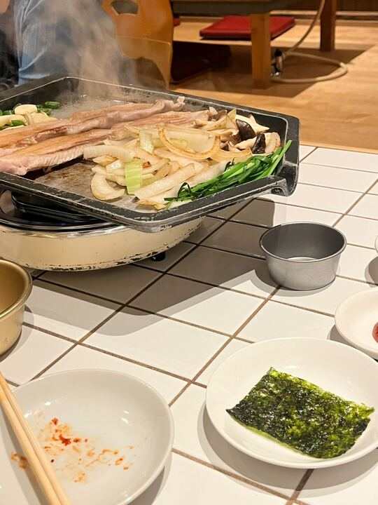
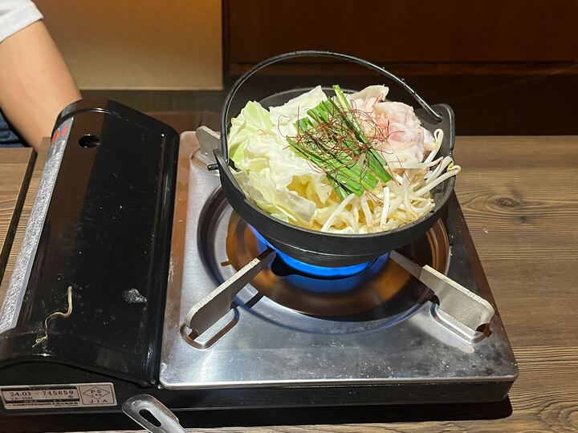
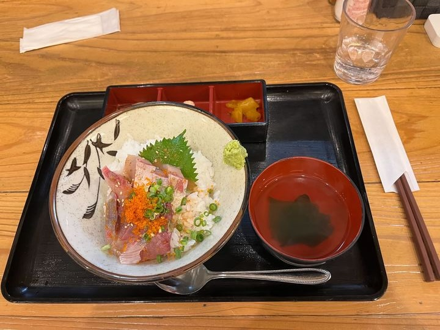
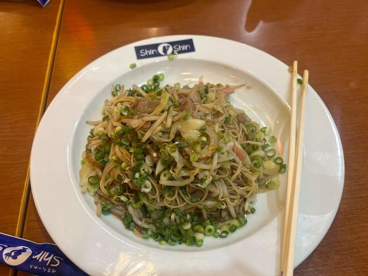

# 旅行にも行ってきましたー

隙間時間にプチ旅行に行ってきました。##　門司港

小倉に近い門司港に行き、海を感じてきました！

さらに関門トンネルに行き、下関まで歩きました。

砲台を間近で見ました。歴史を感じました。

夏の福岡は暑いですね💦

## 小倉城

小倉城に行ってきました。歴史を感じました。城のDX化を感じました。

## 飯

### 1日目

1日目は高橋先生と福岡で人気のラーメンを食べました。ごちそうさまでした！

夜はサムギョプサル。研究室のOBや高橋先生と交流のある方々も参加してくれました。集合写真を撮ったのですが僕の顔が赤すぎて割愛。

### 二日目

二日目は矢田くんともつ鍋、胡麻カンパチ、焼きラーメンを食べました。福岡名物を満喫しました。焼きカレーはまた今度食べたいな。

# 最後に

今度福岡に行ったら、天神と太宰府に行こうと思います！
