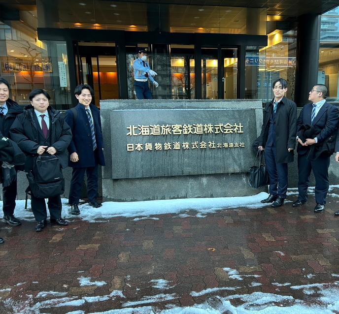
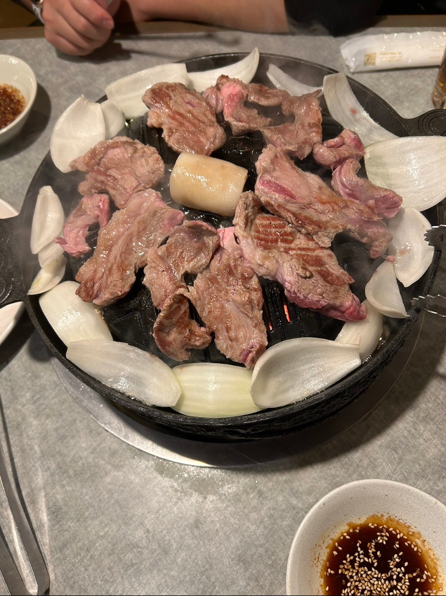

高橋・狩川研究室M1の今井です。
大変お待たせ（？）いたしました。スタディツアー2日目の様子をお届けします。
2日目は**北海道電力様**と**JR北海道様**に伺い、学びを深めました。

# 研修3:北海道電力
1つ目の訪問先は**北海道電力様**です。2050年のカーボンニュートラル達成に向けた、火力発電所の脱炭素化の取り組みについてお話を伺い、議論しました。水素、アンモニアの使用や二酸化炭素の吸収、再生可能エネルギーの拡大に向けたお話をしていただきました。

火力発電所でのアンモニア利用について、燃焼速度の類似から石炭を用いる発電所ではアンモニアを用いるということ、アンモニアを燃焼する際に発生する有害物質（NOx）についての考えなど、専門的かつ大切な内容を多く学ぶことのできる貴重な経験でした。

コミュニケーションの取り方（どのように受け入れていただくか）や、アンモニア発電の展望（石炭＋アンモニアの混焼→アンモニア専焼への移行）についての考えや議論が印象的でした。

# 研修4:JR北海道
2つ目の訪問先は**JR北海道様**です。データ管理の適正化や、技術継承と教育訓練の充実を行なっている安全推進部にお邪魔させていただきました。2011年、2013年に起きた列車事故から、安全な運行と定刻通りの運行のバランスをどのように取っているのか、また2つの事故から得た教訓をどのように活用しているのかというお話をしていただきました。

特に当時の企業文化や制度の問題点、それを踏まえ現在ではどのように刷新しているのか、また2つの事故から得た教訓をどのように次世代に受け継ぎ、風化させないようにしているのかという2点について議論を深めました。

安全への意識が底上げされ、またそれを風化させてはいけないという思いが感じられ、普段何気なく使っている電車が、安全に定刻通りに運行していることにより一層感謝を感じる経験でした。
## JR北海道での1枚

# 夕食タイム
夜はこの日のメインと言っても過言ではないジンギスカンを堪能しました。疲れきっていたはずのメンバー全員が、目を輝かせながらお肉を頬張りました。美味しかったです。

## とっても美味しいジンギスカン

