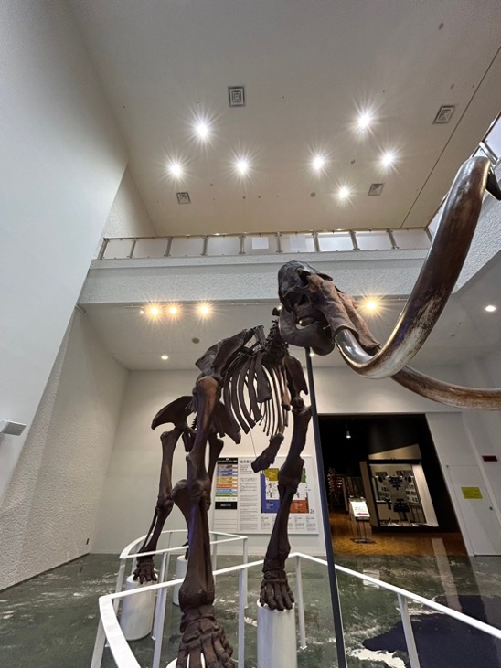
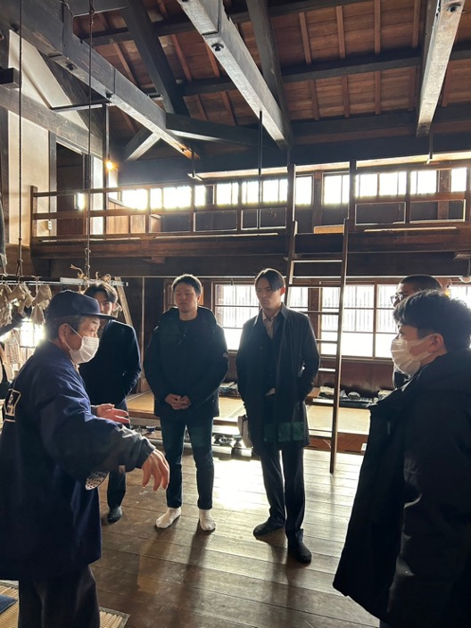
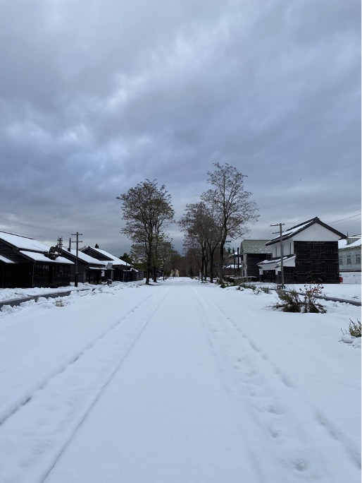
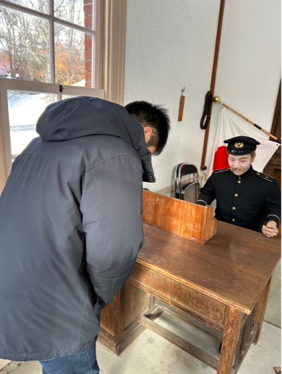
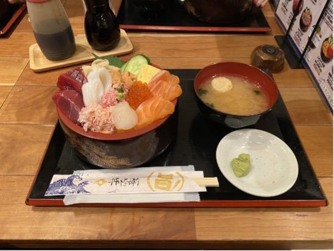
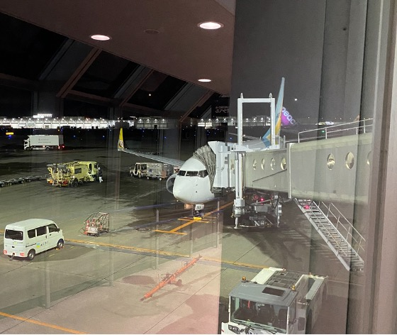

いつの話をしているんだと怒られそうですが，どうかご容赦下さい．
これを書いているときはギリギリM1の**中島**です．

スタディツアー1日目，2日目と企業様を訪問させていただき，安全マネジメントの実現場について様々学ぶ機会を頂きました．最終日は，訪問地である北の大地「北海道」についての理解を深める時間にすべく，主に博物館での学習の時間としました．ここではその最終日について書かせていただこうと思います．

# 研修5：北海道博物館
5つ目の訪問先は，北海道博物館．北海道の自然や歴史，文化について幅広く学ぶことができる，道立の総合博物館です．
非常に多くの展示品があり，アイヌの歴史や北海道の文化についてなど，細かく確かに学ぶことができました．
特に，アイヌ民族の住居を再現した展示が印象的であり，当時の生活を臨場感をもって感じることができました．

## 大きなマンモス？の骨格．迫力満点．

## クマさんとも仲良しになれたね

# 研修6：北海道開拓の村
6つ目の訪問先は，北海道開拓の村．明治から昭和にかけて建築された北海道各地の建造物を，復元・再現した野外博物館であり，開拓当時の生活を肌で感じることができます．
敷地内は一つの街のような作りになっており，実際に建物に入ることもでき，タイムスリップをしたような感覚になりました．

雪で靴が浸水して，足の指が取れた（位痛かった）のも今となっては良い想い出．
（防寒は本当に大事です）

## 語り部の方のお話を聞く姿は皆真剣そのもの

> [!NOTE]
> 暖房がないのでめちゃくちゃ寒かったです

## 前日の雪の影響で一面雪景色

## きちんと礼儀も忘れません

# 番外編：二条市場そして帰路へ
その土地を理解する上で，食文化の理解は欠かせません．
食文化の理解には，やはり実食が一番であるという考えのもと，札幌市内中心部にある「二条市場」を訪問し，海鮮丼を頂きました！！

ウニ，マグロ，サーモンなどが贅沢にあしらわれ，その肉厚な魚介と上質な油，シャリのハーモニーに心を奪われました．が，タイムマネジメントの問題により悠長に味わっている暇もなく，10分程度でおいしく平らげました．
とってもおいしかったです．
## おさかな天国

三日間を通し多くの方々のご協力を頂き，非常に充実したスタディツアーとすることができました．誠にありがとう御座いました．研究室にいると，中々様々なオペレーションの実現場については，想像しにくいものです．今回の貴重な経験を糧とし，引き続きヒューマンファクター，安全人間工学の研究活動に励んでいく所存で御座います．

技術社会システム専攻では，このような研修の企画運営を自ら行う経験ができます．貴重な経験であることはもちろん，とても楽しいです．大学院進学を考えていて，ちょっとでもいいなと思ってくれたそこのあなた，当専攻，当研究室の門を叩いてみて下さい．お待ちしております！！

## 行き帰り共に北海道の翼を利用させていただきました

