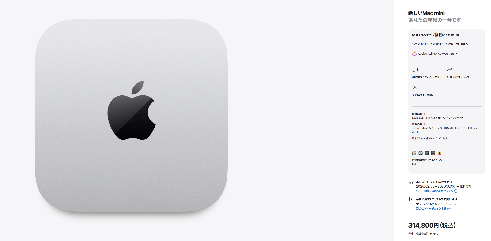

# 明けましておめでとうございます

年末年始にあちこち走り回っていたら卒業研究がかなりキツキツのスケジュールになってしまい、ご挨拶が大変遅くなりました。B4の国仲です。
今年も本研究室をよろしくお願いいたします。

## 年始早々、気になるガジェットが

いきなり個人的な話題なのですが、AppleのMac miniというミニPCが最近気になっています。
AIの研究もしている本研究室だからというわけではないのですが、どうやらローカルLLMを24時間ずっと動かし続けることで「自分専用のAIエージェント」を作ることができるというウワサが耳に入ってしまい、とても興味をそそられている日々です。
Mac miniの省電力性能とAppleエコシステムによる手元のiPhoneなどとの連携によってスマートスピーカーの上位互換に仕立て上げることも夢ではないそう...
でもまずは卒論を仕上げるところからですね。春休みの旅行のことを考えながら、やる気を出していきます！

>[!CUSTOM] amber ruby 見積もり結果
>学割を使って30万円、覚悟が必要ですね
