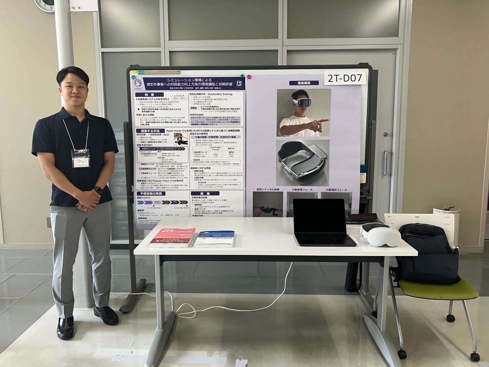
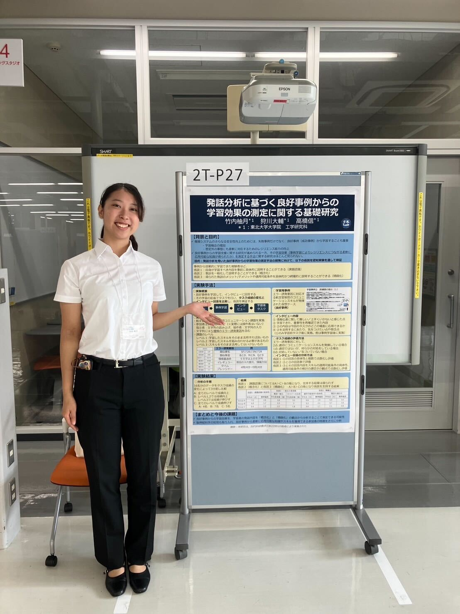

# ヒューマンインタフェース学会in金沢へ
M1の竹内です。9月10日〜12日に、M2の鈴木さんと共に学会に参加しました。
また、M1の日下さんも今後の研究のため一緒に参加しました。

## 金沢の街並み
仙台から金沢は意外と遠かったので、前日入りして少しだけ観光もしました。
駅の鼓門、金沢城、兼六園、東茶屋街、21世紀美術館、金箔！
初の金沢でしたが、街並みが非常に綺麗で、食べ物も全て美味しく本当に最高でした！！！
詳しいことは[ブログ記事](../../../events/2025/human-interface-symposium/blog/index.html)の方で、日下ちゃんが紹介してくれています。ぜひ見てください！

# 学会発表

当日の学会発表では、全国から集まったヒューマンインタフェースに関連する様々な研究が、討論発表（登壇発表）、対話発表（ポスター発表）、デモ発表の3つの形式で発表されました。

鈴木さんは、Vision Proを使ったデモ発表で、参加体験型の発表を行いました。

私、竹内は、ポスター発表を行い、多くの方と議論を深めました。

この学会の面白い点は、学術分野の中でも、文理問わずさまざまな研究が発表されるため、非常に視野が広がりました。
また、学術分野の方の発表だけではなく、デザイン分野で活躍されている方の発表も聞くことができるので、インタフェースについて多角的に学ぶことができました。

# 最後に
今回の学会でさまざまな方からいただいた助言を生かして、今後も研究を進めていきたいと思います！

来年も学会に参加できるように頑張ります！

