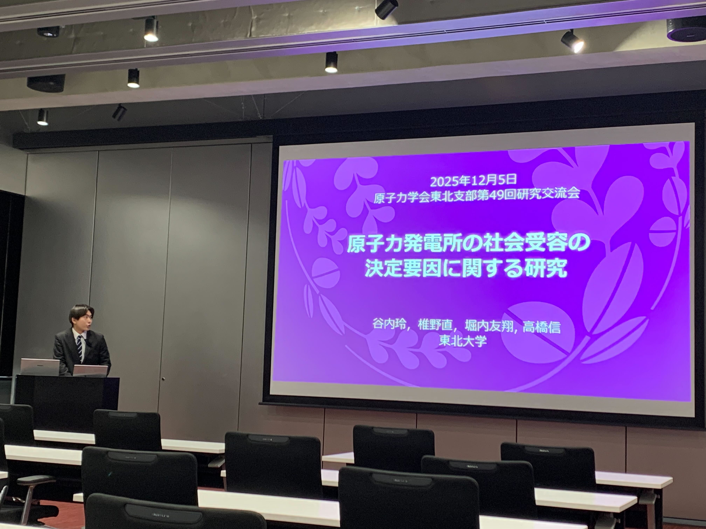
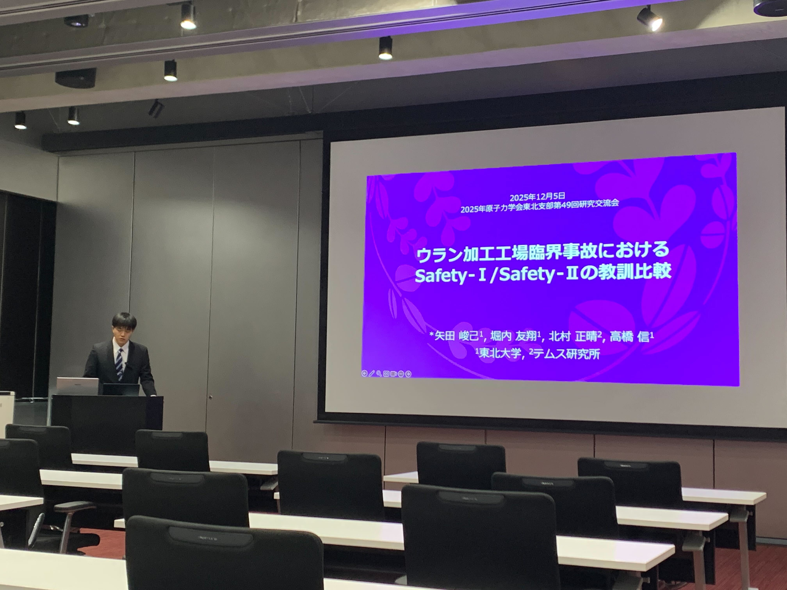
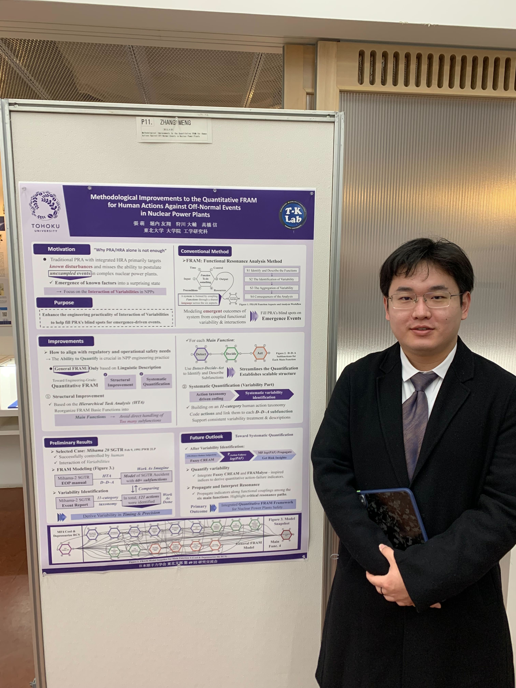

# 研究交流会へ in 仙台

皆さん体調は大丈夫ですか？急激に寒くなっていますので体調管理を大事にしてください。私は寒い外でコンビニのアイスを食べるのにハマっています。北海道生まれの性なんですかね？谷内玲です。
日本原子力学会東北支部第 49 回研究交流会に谷内玲と矢田峻己は口頭発表、張萌はポスター発表してきました！

# 発表

谷内と矢田は初っ端の発表でした。矢田が緊張しているのが意外でした。

萌さんのポスターです！私は受付業務をやっており、見に行けなかった...

# 最後に

皆さんお疲れ様でした！また発表できるよう頑張らないとですね！今年も終わりに近づいていますが、皆さんは年末年始どう過ごされているのでしょうか。私はこたつにくるまってみかんを食べようと思います。
