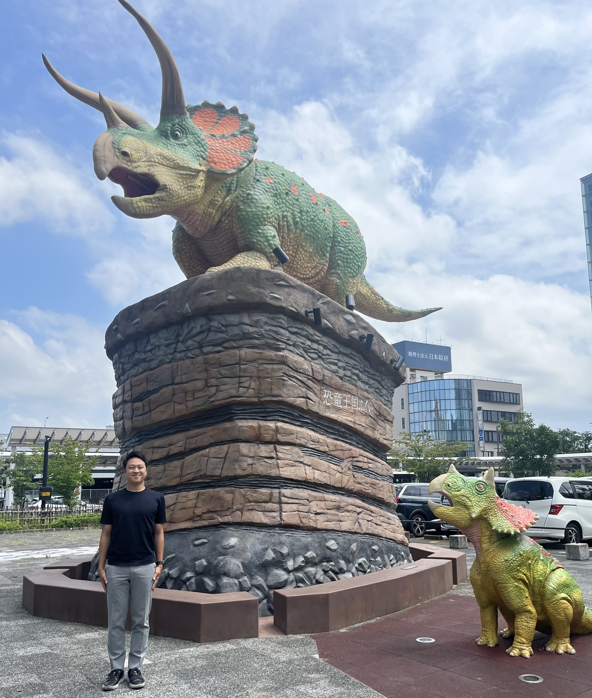
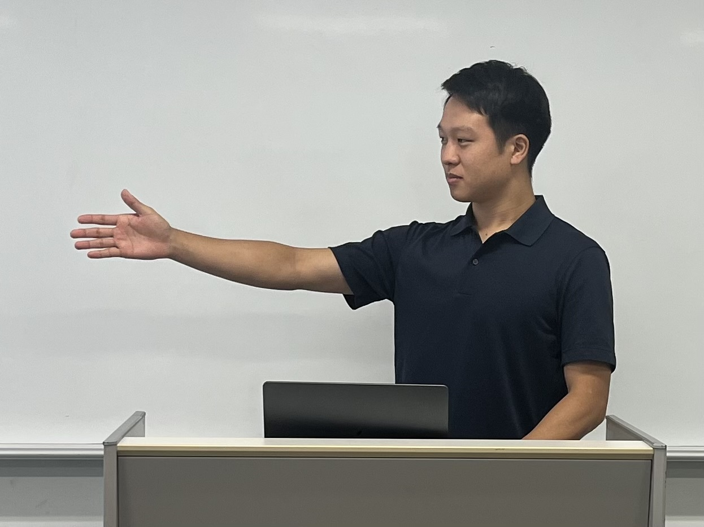

# HI学会研究会へ参加 in 福井

どうも、修士２年の鈴木です。
今回は、福井市内で開催された**HI学会 研究会**に参加してきました！

## 福井の恐竜

福井駅では、シンボルマークとなっている恐竜が出迎えてくれました。

# 研究会

今回の研究会では、いろんな人の研究を聞くことができ、とても刺激になりました。
また、発表は多少緊張しましたが、発表後に多くの質問をいただいて嬉しかったです。
私の研究を一段階進めることができたと感じ、大変充実した研究会でした。

## 発表中

# 次回：HI学会シンポジウムへ

今回の研究会を終えて、いくつかの課題が新たに見つかりました。
次回は９月に金沢で実施されるHI学会シンポジウムのデモ発表を行う予定です。
シンポジウムでは、今回の課題を修正し、より進展した研究内容を発表できればと思います。
私の研究の実験環境を体験することができますので、来ていただけたら幸いです。
それでは、また！
